# 1. Архитектуры компьютерных сетей, их характеристики.

Архитектура - спецификации связи, разработанные для определения функций сети и установления стандартов различных моделей вычислительных систем, предназначенных для обмена и обработки данных.

Для стандартизации сетей Международная организация стандартов (ISO/OSI) предложила семиуровневую сетевую архитектуру. Это предложение хорошо в теории, но конкретные реализации сетей не используют все уровни международного стандарта. Однако этот стандарт дает общее представление о взаимодействии отдельных подсистем сети и потому выступает «эталоном».

## Семиуровневая сетевая архитектура

1. **Физический уровень (Physical Layer).** Обеспечивает виртуальную линию связи для передачи данных между узлами сети. На этом уровне выполняется преобразование данных, поступающих от следующего, более высокого уровня, в сигналы, передающиеся по физическим носителям. Элемент информации – бит. Примеры протоколов, действующих на этом уровне - Wi-Fi, Bluetooth.

2. **Канальный (Data Link Layer).** Обеспечивает виртуальную линию связи более высокого уровня, способную безошибочно передавать данные в асинхронном режиме. При этом данные обычно передаются блоками, содержащими дополнительную управляющую информацию. Такие блоки называют кадрами. При возникновении ошибок автоматически выполняется повторная посылка кадра. Кроме того, на уровне управления линией передачи данных обычно обеспечивается правильная последовательность передаваемых и принимаемых кадров. Последнее означает, что если один компьютер передает другому несколько блоков данных, то принимающий компьютер получит эти блоки данных именно в той последовательности, в какой они были переданы. Пример протокола, действующего на этом уровне - Token ring.

3. **Сетевой уровень (Network Layer).** Предполагает, что с каждым узлом сети связан некий процесс. Процессы, работающие на узлах сети, взаимодействуют друг с другом и обеспечивают выбор маршрута передачи данных в сети (маршрутизацию), а также управление потоком данных в сети. В частности, на этом уровне должна выполняться буферизация данных. Элемент информации – дейтаграмма (пакет). Пример протокола, действующего на этом уровне - IPv4, IPv6, ICMP.

4. **Транспортный уровень (Transport Layer).** Выполняет разделение передаваемых сообщений на пакеты на передающем конце и сборку на приемном конце. На этом уровне может выполняться согласование сетевых уровней различных несовместимых между собой сетей через специальные шлюзы. Например, такое согласование потребуется для объединения локальных сетей в глобальные. Элемент информации – пакет (сегмент, дейтаграмма). Пример протоколов, действующих на этом уровне – UDP, TCP, SCTP.

5. **Сеансовый уровень (Session Layer).** Обеспечивает поддержание/разрыв сеанса связи, позволяя приложениям взаимодействовать между собой длительное время. Уровень управляет созданием/завершением сеанса, обменом информацией, синхронизацией задач, определением права на передачу данных и поддержанием сеанса в периоды неактивности приложений. На практике этот уровень зачастую «отпадает». Элемент информации – сообщение. Пример протокола, действующего на этом уровне – SOCKS.

6. **Уровень представления (Presentation Layer).** Описывает шифрование данных, их сжатие и кодовое преобразование. На практике этот уровень зачастую «отпадает». Элемент информации – сообщение. Например, к этому уровню можно отнести шифрование ASCII.

7. **Прикладной уровень (Application Layer).** Отвечает за поддержку прикладного программного обеспечения конечного пользователя. Элемент информации – сообщение. Пример протоколов, действующих на этом уровне – TELNET, POP3, SMTP, HTTP.

Уровни с межсетевого по прикладной реализуются програмно.

## Архитектуры КС

- ODNA (DECNet) - Основным коммутационным элементом сетевой архитектуры DNA является узел. Все узлы равноправны, т.е. каждый узел, может выступать в качестве любого функционального элемента ИВС. Узлы закреплены за различными областями (подобластями). Каждая область имеет своего администратора и средства маршрутизации. Каждый узел имеет свой уникальный адрес. Структура адреса DECnet-4: 1 байт -номер области, 1 байт - номер подобласти, 6 байт - Ethernet адрес.
- SNA
- DARPA (TCP/IP, Internet)
- Novell Netware
- SMB
- AppleTalk
- XNS
- IPv6

**Характеристики:**

1. Иерархия протоколов

2. Соответствие модели ISO

3. Адресация
   - Узлов
     - Индивидуальная
     - Групповая
     - Широковещательная
   - Приложений

4. Связь сетевого и канального уровней
   - Разрешение адресов
   - Фрагментация
     - Поузловая // IPv4
     - На источнике // IPv6

5. Сетевые протоколы

6. Маршрутизация
   - По типу маршрута
     - Индивидуальная
     - Групповая
   - По адаптивности к изменениям в сети
     - Статическая
     - Динамическая
     - Предопределенная («от источника»)
   - По месту проведения маршрутных вычислений
     - Централизованная
     - Децентрализованная // Характерно для TCP/IP
     - Гибридная
   - По числу возможных маршрутов
     - Однопутевые
     - Многопутевые
   - По характеру используемой информации
     - Глобальные
     - Локальные // Большинство
     - Смешанные

7. Транспортные механизмы
   - Дейтаграммные транспортные протоколы
   - Потоковые транспортные протоколы
   - Многопоточные транспортные протоколы

8. Именование ресурсов
   - Одноуровневое
   - Двухуровневое
   - Иерархическое

9. Прикладные протоколы
   - Протоколы удаленного терминала
   - Протоколы передачи файлов
   - Протоколы электронной почты
   - …

10. Управление

11. Защита информации

# 2. Архитектура TCP/IP. Иерархия протоколов.

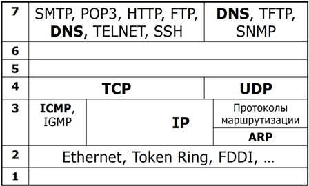

- Физический
- Канальный
- Сетевой
- Транспортный
- Сеансовый
- Представления
- Прикладной 

**ARP Address Resolution Protocol** - Отвечает за получение MAC адреса хоста, размещенного в текущей сети, по его IP адресу. Использует broadcast. Для передачи данных по сети хост должен знать MAC адрес хоста, которому передаются данные. Для получения МАС адреса по известному IP адресу служит протокол ARP.

**ICMP Internet Control Message Protocol** - Посылка сообщений об ошибках, обнаруженных в процессе передачи пакетов. Служит для общения маршрутизатора с хостом, отправляющим или посылающим данные контрольными сообщениями и сообщениями об ошибках. Использует для передачи IP и является его составной частью.

**IGMP Internet Group Management Protocol** - Информирует маршрутизаторы о наличии в данной сети multicast группы. Информация рассылается по маршрутизаторам, поддерживающим рассылку таких сообщений.

**IP Internet Protocol** - Обеспечивает маршрутизацию пакетов. IP не устанавливает непосредственное соединение между хостами, а используют адреса, помещенные в заголовок IP пакета, для передачи их получателям. Выбор пути передачи называется маршрутизацией. IP используют поля в заголовке для фрагментации и восстановления датаграмм Internet, когда это необходимо для их передачи через сети с малым размером пакетов. Не требует подтверждения получения данных. Это означает, что отправитель и получатель не информируются о пропаже пакета или неправильной последовательности получения пакетов.

**TCP Transmission Control Protocol** - Обеспечивает соединение между двумя хостами, с гарантируемой доставкой пакетов. Транспортный протокол с гарантированной доставкой пакетов. Данные представляются как поток байтов и могут передаваться в обоих направлениях. Некоторое количество октетов могут упаковываться в сегменты для передачи через системы Internet. Достоверность передачи информации достигается присваиванием каждому сегменту уникального номера в последовательности. Для проверки доставки сегмента используются подтверждения (ACK), которые возвращаются для каждого посланного сегмента. Если подтверждение не получено, то данные посылаюся еще раз через некоторый интервал времени (timeout). Если сегмент пришел поврежденным, то хост уничтожает этот пакет и не посылает подтверждение получения.

**UDP User Datagram Protocol** - Обеспечивает соединение между двумя хостами, при котором не гарантируется доставка пакетов. Обеспечивает соединение с негарантированной доставкой пакетов. Используется в приложениях, не требующих подтверждения получения пакетов (NetBIOS name service, NetBIOS datagram service, SNMP).

# 3. IP-адресация. Классы IP-сетей.

IP адрес состоит из 32 разрядов и записывается в виде четырех десятичных октетов через точку. Это позволяет адресовать 232 (около 4 млрд) узлов. Поддерживается индивидуальная, широковещательная и групповая адресации. Адресуется конкретный сетевой интерфейс, а не узел, однако одному интерфейсу можно придать несколько IP-адресов.

Адресное пространство поделено на 5 классов:

- класс A – для сетей большого размера
- класс B – для сетей среднего размера
- класс C – для небольших сетей 
- класс D – для групповых адресов
- класс E – зарезервировано для экспериментов

## Адреса класса А.

Формат адреса:

`0nnnnnnn.hhhhhhhh.hhhhhhhh.hhhhhhhh`

- n – разряды номера сети
- h – разряды номера узла

В итоге получается 126 сетей (2 зарезервированы) и 224-2 узлов в сети (около 16 млн.).

## Адреса класса B.

Формат адреса:

`10nnnnnn.nnnnnnnn.hhhhhhhh.hhhhhhhh`

- n – разряды номера сети
- h – разряды номера узла

В итоге получается 214 = 16384 сетей и 216-2 = 65534 узлов в сети.

## Адреса класса С.

Формат адреса:

`110nnnnn.nnnnnnnn.nnnnnnnn.hhhhhhhh`

- n – разряды номера сети
- h – разряды номера узла

В итоге получается 221 сетей (около 2 млн.) и 28-2 = 254 узла в сети.

## Адреса класса D.

Формат адреса:

`1110xxxx.xxxxxxxx.xxxxxxxx.xxxxxxxx`

- x – разряды адреса

В итоге получается 228 адресов (около 256 млн.).

## Адреса класса E.

Формат адреса:

`1111xxxx.xxxxxxxx.xxxxxxxx.xxxxxxxx`

- x – разряды адреса

В итоге получается 228 адресов (около 256 млн.).

Валидные пакеты в Internet не должны иметь адреса класса Е.

## Зарезервированные IP-адреса

- адрес 0.0.0.0 – маршрут по умолчанию
- узел данной IP-сети:
  - А: `00000000.hhhhhhhh.hhhhhhhh.hhhhhhhh`
  - B: `10000000.00000000.hhhhhhhh.hhhhhhhh`
  - C: `11000000.00000000.00000000.hhhhhhhh`
- конкретная IP-сеть
  - A: `0nnnnnnn.00000000.00000000.00000000`
  - B: `10nnnnnn.nnnnnnnn.00000000.00000000`
  - C: `110nnnnn.nnnnnnnn.nnnnnnnn.00000000`
- все узлы данной IP-сети (*)
  - A: `0nnnnnnn.11111111.11111111.11111111`
  - B: `10nnnnnn.nnnnnnnn.11111111.11111111`
  - C: `110nnnnn.nnnnnnnn.nnnnnnnn.11111111`
- все узлы данной локальной сети: 255.255.255.255`
- петля обратной связи: 127.x.x.x`
- IANA зарезервировала несколько диапазонов адресов:
  - `10.0.0.0` – `10.255.255.255`
  - `172.16.0.0` – `172.31.255.255`
  - `192.168.0.0` – `192.168.255.255`
- `224.0.0.1` – все узлы данной подсети
- `224.0.0.2` – все маршрутизаторы данной подсети
- `224.0.0.5` – все OSPF маршрутизаторы
- `224.0.0.6` – все назначенные OSPF маршрутизаторы
- `224.0.0.9` – все RIP-2 маршрутизаторы
- `224.0.0.10` – все IGRP маршрутизаторы

# 4. Структуризация IP-сетей. Понятие маски сети. Организация подсетей, префикс сети.

## Маска подсети:

- 32-х разрядный вектор флагов
- «1» в i-ом разряде маски – i-ый разряд адреса содержит часть номера сети или подсети
- «0» в i-ом разряде маски – i-ый разряд адреса содержит часть номера узла

## Пример макси для сети класса С:

Формат адреса класса С: `110nnnnn.nnnnnnnn.nnnnnnnn.hhhhhhhh`

- n – разряды номера сети; 
- h – разряды номера узла;

если маска = `11111111.11111111.11111111.11000000` (`255.255.255.1921), то 4 подсети по 64 адреса в каждой.

Два адреса в подсети зарезервированы (первый – адрес подсети, последний – широковещательный адрес подсети). Допускается в одной сети иметь подсети разного размера (VLSM).

Префикс – число единиц в маске. Для сети А префикс равен 8, для В = 16, а для С = 24.

Надсети – объединение нескольких сетей.

### Пример 1:

- Сети `195.19.212.0` и `195.19.213.0`
- Общая надсеть на 512 адресов: `195.19.212.0`/`255.255.254.0`

Если А – IP-адрес узла, М – маска подсети, то

Адрес подсети = A & M

Широковещательный адрес = A v (!M)

Максимальное число узлов сети = !M - 1

## Адресация сервисов (приложений):

Порт – уникальный номер приложения на узле, использующего конкретный транспортный протокол.

В TCP/IP порт – 16 разрядов (0 ... 65535)

Приложение идентифицируется сокетом:

- IP-адресом узла
- Типом транспортного протокола
- Номером порта

Примеры:

- TCP-сокет: 195.19.212.13:80
- UDP-сокет: 195.19.212.10:53

# 5. Архитектура сетей ТСP/IP. Протокол IP.

**IP – Internet Protocol** – межсетевой протокол. Нужен, чтобы объединить разные сети, использующие разные технологии передачи данных. IP – основной протокол, использующийся в Интернете.

В модели ISO/OSI расположен на Сетевом уровне

В модели TCP/IP расположен на Сетевом уровне

IP передает данные без установления соединения. IP обеспечивает передачу данных без гарантии доставки и без сохранения порядка следования сообщений

IP просто посылает пакет в сеть. Если пакет не дошел, то IP никак об этом не оповещает и не пытается заново отправить недошедший пакет. Такие ошибки должны быть исправлены протоколами на вышестоящих уровнях

**Задачи IP:**

- **объединение сетей** с разными технологиями в одну крупную сеть
- **маршрутизация**. поиск маршрута от отправителя к получателю
- качество обслуживания

## Формат пакета:

- **Version** - Версия протокола. Текущая версия 4 (0100).
- **Header Length** - Количество 32 битных слов в заголовке пакета. Минимальная размер заголовка 20 байт, то есть в Header Length = 0x5. Наличие информации в поле Options может увеличить размер заголовка максимум на 4 байта. Если это поле заполнено не полностью, то заполненные биты покрываются 32 битными словами и незаполненная часть заполняется нулями. 
- **Type of Service** - Желаемое качество обслуживания пакета при его доставке.
- **Total Length** - Общая длина IP пакета.
- **Identifier** - Идентификатор пакета. Если пакет фрагментирован, то все фрагменты имеют одинаковый идентификатор. Это необходимо для восстановления исходного пакета.
- **Fragmentation Flags** - Флаги фрагментации. В настоящее время используется только два бита. Один показывает, фрагментирован пакет или нет, второй говорит о наличии фрагментов, следующих за текущим.
- **Fragment Offset** - Позиция фрагмента внутри пакета. Если пакет не фрагментирован то 0x0.
- **Time to Live** - количество раз, которое пакет может пройти через маршрутизаторы. При прохождении через маршрутизатор, TTL уменьшается на 1. При TTL = 0 пакет уничтожается. Такой механизм помогает, если пакет попал в "петлю". Чтобы сеть со временем не перегрузилась пакетами, они сами уничтожаются когда TTL достигает 0. 
- **Protocol** - Тип транспортного протокола, используемого при передаче (TCP или UDP)
- **Header** **Checksum** - Контрольная сумма.
- **Source** **Address** - Идентификатор отправителя пакета.
- **Destination Address** - Идентификатор получателя пакета.
- **Options and Padding** - Переменное число 32 битных слов (максимум 4 байта) используются для дополнительной информации о пакете.

# 6. Связь c канальным уровнем в ТСP/IP. Протокол разрешения адреса ARP.

ARP – Address Resolution Protocol – протокол разрешения адресов

Нужен для определения MAC-адреса устройства по его IP-адресу

Для определения MAC-адреса использует схему ARP-запрос – ARP-ответ

Алгоритм:

1. Компьютер, который хочет узнать MAC-адрес определенного компьютера в сети посылает **широковещательный** ARP-запрос на все компьютеры в сети с вопросом «У кого IP 192.168.10.43?»

2. Компьютер с IP адресом = 192.168.10.43, отправляет ARP-ответ со своим MAC-адресом

3. Компьютер-отправитель получает ARP-ответ, вытаскивает из него MAC-адрес и использует его для дальнейшей передачи данных по сети

- Network Type – тип канального протокола. Ethernet = 1 
- Protocol - протокол сетевого уровня. IP = 2048 
- HAL - длина канального адреса 
- PAL - длина сетевого адреса
- Operation - тип операции. 1 = запрос. 2 = ответ.
- Source Hardware Address - MAC адрес отправителя
- Source IP Address - IP адрес отправителя
- Dest. Hardware Address - MAC адрес получателя
- Dest. IP Address - IP адрес получателя

# 7. Групповая доставка в TCP/IP. Протокол IGMP.

В TCP/IP в качестве multicast’а используется Internet Group Management Protocol (IGMP)

- Протокол сетевого уровня.
- Предназначен для решения задач:
  - Управления.
  - Нотификации об ошибках и проблемах.
  - Тестирования и мониторинга.
- Описан в стандарте RFC792.
- Инкапсулируется в IP.
- Используется только в сетях IPv4; в IPv6 есть аналог.

IGMP (англ. Internet Group Management Protocol — протокол управления группами Интернета) — протокол управления групповой (multicast) передачей данных в сетях, основанных на протоколе IP. IGMP используется маршрутизаторами и IP-узлами для организации сетевых устройств в группы. Информирует маршрутизаторы о наличии в данной сети multicast группы. Информация рассылается по маршрутизаторам, поддерживающим рассылку таких сообщений.

Всего есть три версии, обратно совместимые с предыдущими.

## 1. Стандарт 1ой версии – RFC 1112.

Маршрутизатор регулярно посылает запросы вида «Хей, есть кто с такой группой?». Отчет посылается с задержкой, чтобы множество ответов, иначе бы высланные в унисон, не уронили сеть.

Хост должен посылать отчет о каждой группе.

Если на запрос не присылаются отчеты => членов групп больше нет.

Типы - определяет тип IGMP сообщения: «1» соответствует запросу, «2» ответу.

Адрес группы: В запросе – 0, в ответе – существующий номер группы

При этом, в IP-пакете-«обёртке» используется: адрес 224.0.0.1 и TTL = 1 (чтобы пакет не «улетел» из сети)                   

## 2. Активно используется вторая версия, её стандарт – RFC 2236.

Появились типы сообщений:

- 0x11 – запрос о членстве в группах или конкретной группе
- 0x16 – отчет о членстве v2
- 0x17 – запрос-нотификация о покидании группы
- 0x12 – отчет о членстве v1 (для совместимости)

Макс. время – максимальное время ответа в 0.1 с

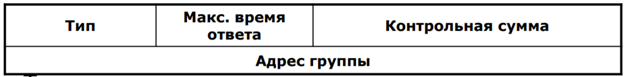

## 3. Стандарт – RFC3376. IGMP V3 Позволяет:

- В одном пакете запросить несколько групп
- В одном пакете отчитаться о нескольких группах

# 8. Управляющий протокол ICMP. Сигнализирующие сообщения.

## Общие сведения

- Протокол сетевого уровня;
- Решает задачи 
  - управления,
  - нотификации об ошибках, 
  - тестирования и мониторинга;
- Инкапсулируется в IP *(да, протокол сетевого уровня в протоколе сетевого уровня)*;
- Описан в RFC792.

Задачи управления и нотификации – базовые функции сетевого уровня. При этом авторы архитектуры не зашили это в протокол IP, а выделили в отдельный протокол. Один из важнейших для стека TCP/IP.

ICMP-трафик обычно не пускают на широковещательные адреса.

## Организация протокола ICMP

Общая часть заголовка *(8, 8, 16 бит)*:

- Тип – тип пакета;
- Код – расшифровка типа (подтип);
- Контрольная сумма вычисляется для всего пакета.

Остальная часть пакета зависит от типа ICMP-пакета.

## Нотификационные (сигнализирующие) сообщения

Информируют отправителя о каком-либо событии в сети.

***Нотификационные сообщения фильтровать нельзя!***

### Основные типы:

- 3 – получатель недостижим *(нельзя фильтровать в своей сети)*: 
  - Тип (3);
  - Код *(причина «недостижимости»)*:
    - 0 – сеть недостижима;
    - 1 – узел недостижим;
    - 2 – протокол недостижим *(например, хотим доставить по* *TCP, но приемная сторона его не поддерживает)*;
    - 3 – порт недостижим *(когда никто {сервис, приложение} не прослушивает порт)*;
    - 4 – требуется фрагментация *(в* *IP-пакете установлен флаг, запрещающий фрагментацию, но сам пакет слишком большой для передачи целиком по каналу)*;
    - 5 – ошибка маршрутизации от источника *(когда не можем строго пройти через указанные адреса {строгая маршрутизация от источника в* *IP})*;
    - 6 – сеть назначения неизвестна *(обычно – попытки маршрутизации в сеть класса Е, то есть в адреса, которые не маршрутизируются в сетях* *TCP/**IP)*;
    - 7 – узел назначения неизвестен *(c**м. 6)*;
    - 8 – отправитель изолирован *(обычно – нет действующих интерфейсов для отправки пакета)*;
    - 9 – взаимодействие с сетью назначения административно запрещено *(фаервол – стоит правило* *REJECT {а вообще есть* *accept,* *deny,* *reject, но обычно во избежание перегрузки сети ответными пакетами ставят* *DENY и молча отбрасывают пакеты})*;
    - 10 – взаимодействие с узлом назначения административно запрещено *(см 9)*.
    - 11 – сеть недостижима из-за класса обслуживания *(используются разряды* *TOS, на всех маршрутизаторах внутри сети настроено управление качеством обслуживания, а мы запросили сервис выше нашего уровня)*;
    - 12 – узел недостижим из-за класса обслуживания *(см. 11)*.
  - Контрольная сумма;
  - Нулевое слово;
  - Заголовок и первые два слова пакета *(который не смогли доставить)*;
- 11 – превышено время *(нельзя фильтровать в своей сети)*: 
  - Тип (11);
  - Код:
    - 0 – превышено TTL;
    - 1 – превышено время ожидания фрагмента при сборке;
  - Последнее поле содержит первую часть пакета, фрагмент которого не дошел;
- 12 – ошибка параметра *(нельзя фильтровать в своей сети)*: 
  - Тип (12);
  - Указатель (байтовый). *(В случае, если какой-либо из промежуточных маршрутизаторов или конечный узел, проанализировав заголовок* *IP-пакета, определил, что произошла ошибка {невалидное значение поля, неверная контрольная сумма…}, он сообщает о ней, указывая номер ошибочного байта)*;
  - Последнее поле содержит первую часть пакета, в котором обнаружена ошибка;

# 9. Управляющий протокол ICMP. Управляющие и тестовые сообщения

*(!TODO)*

**Общие сведения ICMP** – 8 вопрос 

## Управляющие сообщения

Управляющие сообщения – попытка «повлиять» на саму сеть.

### Основные типы:

- 4 – подавление источника *(не синхронизирована скорость передачи данных между передатчиком и приемником. Если передатчик слишком быстро передает пакеты, приемная сторона передает следующий пакет. Передающая сторона по умолчанию снижает скорость передачи в 2 раза. Фильтровать нежелательно)*:
   
  - Тип (4);
  - Последнее поле содержит первую часть пакета, поток которого необходимо замедлить;
- 5 – изменение маршрута *(если пакет с точки зрения маршрутизатора отправляется неоптимальным путем. Отправляет ответ отправителю в качестве совета по перемаршрутизауции)*:
   
   
   *Легко подделывается. С начала 2000-х фильтруется во всех ОС. По возможности такие пакеты убиваются на всех маршрутизаторах!
   Проблемы:*
   *Функция маршрутизации реализуется протоколами маршрутизации, а не* *ICMP-протоколом (управляющим). Невозможно проконтролировать, кто создал пакет и валидный ли он.*
  - Тип (5);
  - Код *(тип переназначения маршрута)*:
    - 0 – для всей сети,
    - 1 – для узла,
    - 2 – для типа сервиса и сети,
    - 3 – для типа сервиса и узла;
  - IP-адрес маршрутизатора, *куда* необходимо присылать пакеты;
  - Заголовок IP-пакета, который (с точки зрения маршрутизатора-отправителя) идет неоптимальным путем).

## Тестовые и контрольные сообщения

Позволяют проводить диагностику сети.

Обычно идут парами «запрос-ответ».

### Типы:

- Запрос эха (8) и ответ на запрос эха (0) (*ping* и *pong. Проверка работоспособности удаленного узла. Используется в утилитах типа* *ping и ей подобных, позволяющих проверить достижимость узла в сети)*:
   
   Идея: станция посылает удаленной станции пакет с типом 8, промежуточные маршрутизаторы доводят его до последней станции. Та, получив его, уничтожает, в ответ формирует такой же пакет с типом 0, а в поле данных копирует те необязательные данные, которые были в поле эхо-запроса, после чего посылает обратно.
   *Обычно в своей сети разрешаем 8 на выход и 0 на вход. Остальное отрубаем. Иногда – ставим прокси (**ICMP-сервер**), чтобы он формировал фейковые сообщения за все компьютеры в сети.*
  - Тип (8 или 0);
  - Идентификатор (для различения пар потоков *ping*-ов и *pong*-ов. По нему определяется процесс, которому отдают ответный трафик);
  - Последовательный номер *(номер пакета в серии. Для посылки не одного, а нескольких пакетов. Для сопоставления ответа запросу)*;
  - Необязательные данные (тестирование на прохождение пакетов данных определенного размера по каналу связи. Могут расширить *ICMP-пакет* до 64 Кб. Большие пакеты могут фильтроваться по размеру из-за имевшей место атаки «*ping of death*»);
  
- Запрос временной метки (13) и ответ на запрос временной метки (14):
   
   
   *(позволяют определить временные параметры функционирования сети)*
  - Идентификатор – номер потока сообщений;
  - Последовательный номер – номер пакета в потоке;
  - (T1) **Временная метка отправителя** заполняется источником *(время, когда пакет улетел из отправителя)*;
  - (T2) **Временная метка приема** фиксируется при получении запроса приемником *(время, когда пакет пришел на приемную станцию)*;
  - (T3) **Временная метка передачи** заполняется приемником *(когда был послан ответ)*;
  - (T4) Еще мы знаем время, когда мы получим ответ обратно от приемника;
  - Проблемы:
    - Синхронизация часов;
    - Фильтрация.
  
- Запрос маски адреса (17) и ответ на запрос маски адреса (18):
   
   *(Чаще всего – чтобы узнать топологию удаленной сети. Считается опасным, не рекомендуется к использованию вне текущей сети)*.

  - Идентификатор – номер потока сообщений;

  - Последовательный номер – номер пакета в потоке;

  - Маска – записанная маска адреса приемника.

# 10. Адресация приложений. Понятие портов.

## Понятие портов

- Порт – уникальный номер приложения на узле, использующего конкретный транспортный протокол
- В TCP/IP порт – 16 разрядов (0...65535)
- Приложение идентифицируется сокетом:
  - IP-адресом узла
  - Типом транспортного протокола
  - Номером порта
- Примеры:
  - TCP-сокет: 195.19.212.13:80
  - UDP-сокет: 195.19.212.10:53
- Есть некоторые правила по умолчанию, которые все стараются соблюдать: 
  - Сервер обычно использует фиксированные номера портов из диапазона от 0 до 1023.
  - Клиент обычно использует непривилегированные номера портов из диапазона 1024+. В некоторых ОС для того, чтобы выдать приложению порт меньше 1024, требуется, чтобы приложение имело достаточно привилегий и прав. 
- Философия, которую пыталась сделать IANA, а теперь ICANN: 
  - 1024 адреса – это зарезервированные адреса, которые мы выдаём всем известным сервисам, а то, что выше 1024 – это свободно распространяемые номера портов.
  - Для сервера важно иметь предопределённый номер, потому что мы должны из разных узлов должны к нему обращаться и знать его номер, нам важно, чтобы он был фиксированный и публичный. А для клиента неважно, чтобы его номер был фиксированный, потому что к клиенту никто напрямую не обращается за редким исключением. Поэтому адрес клиента не должен быть публичным, его можно выдавать временно на 1 сеанс, что и сделано в большинстве протоколов.

### Транспортный протокол UDP

Является транспортным механизмом архитектуры TCP/IP.

**UDP** – User Datagram Protocol, протокол без установления соединения.

Дейтаграмный обмен:

- Не гарантирует последовательность доставки
- Не обеспечивает квитирование
- Реализуется протоколом UDP

Особенности (по сравнению с другими):

- Более высокая скорость
- Меньшая надежность

Зарезервирован номер 17 в IP-пакете

Для адресации используются UDP-порты

Сервер обычно использует фиксированные номера портов (1-1023)

Клиент обычно использует непривилегированные номера портов (1024-65535)

**Формат пакета:**

| Порт отправителя | Порт получателя   |
| ---------------- | ----------------- |
| Длина сообщения  | Контрольная сумма |
| Данные           |                   |

Длина сообщения включает заголовок и данные.

Контрольная сумма:

- Вычисляется по всему пакету
- Если контрольная сумма равна 0, то она не вычислялась (для сверхнадежного канала)
- Контрольная сумма вычисляется с учетом псевдозаголовка:

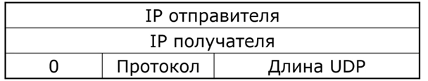

Приложения, использующие UDP:

- TFTP – 69
- DNS – 53
- SNMP – 161, 162
- BOOTP, DHCP – 67, 
- 68RIP - 520

# 12. Транспортный протокол TCP. Формат пакета TCP.

## Общая информация:

- TCP – Transmission Control Protocol
- Стандарт – RFC793
- По сравнению с UDP имеет:
  - Более низкую скорость
  - Большую надежность
- Зарезервирован номер 6 в IP-пакете
- Адресация приложений осуществляется с помощью TCP-портов
- Передача – потоковая
- Данные для передачи хранятся в буфере:
  - Данные от приложения добавляются конец буфера
  - Данные для передачи в сеть берутся из начала буфера
- Пересылаемая порция данных называется – сегмент.
- Каждый передаваемый байт – пронумерован
- Сегменту присваивается номер его первого байта (номер очереди)
   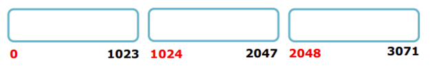
- При посылке в сеть сегмента:
  - Сегмент копируется в буфер повторной передачи
  - Взводится таймаут

## Передача сегмента в сеть:

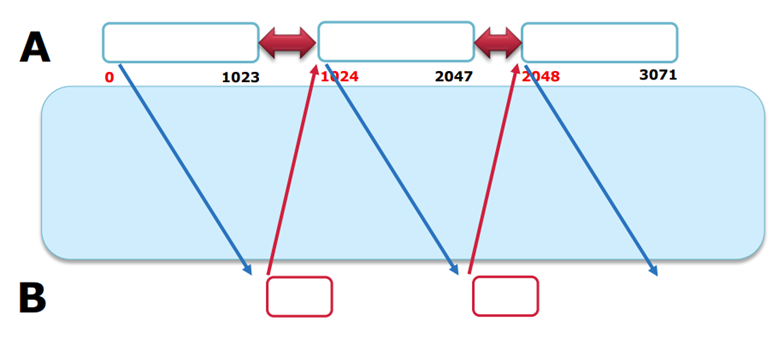

- Каждый посланный в сеть байт должен быть подтвержден
- При получении подтверждения от сегмента подтвержденными считаются все байты сегмента
- Если подтверждение не получено в течение определенного времени – сегмент из буфера повторной передачи посылается заново
- Подтверждение содержит номер следующего ожидаемого байта
- В TCP отрицательные квитанции не посылаются

## Формат пакета:

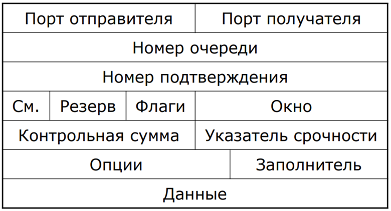

- Номер очереди
  - Номер посланного сегмента при обмене
  - Синхронизация номеров сегментов при установлении соединения
- Номер подтверждения
  - Подтверждение принятого сегмента
  - Синхронизация номеров сегментов при установлении соединения
- Смещение данных – длина заголовка TCP
- Окно – величина скользящего окна
- Контрольная сумма – сегмента
- Указатель срочности – объем срочных данных

**Порт источника**

Порт источника идентифицирует приложение клиента, с которого отправлены пакеты. По возвращении данные передаются клиенту на основании номера порта источника.

**Порт назначения**

Порт назначения идентифицирует порт, на который отправлен пакет.

**TCP-порты**

Существует набор служб (использующих для передачи данных TCP), за которыми закреплены определенные порты.

**Номер последовательности**

Номер последовательности выполняет две задачи:

1. Если установлен флаг SYN, то это начальное значение номера последовательности — ISN (Initial Sequence Number), и первый байт данных, которые будут переданы в следующем пакете, будет иметь номер последовательности, равный ISN + 1. 

2. В противном случае, если SYN не установлен, первый байт данных, передаваемый в данном пакете, имеет этот номер последовательности.

**Номер подтверждения**

Если установлен флаг ACK, то это поле содержит номер последовательности, ожидаемый получателем в следующий раз. Помечает этот сегмент как подтверждение получения.

**Смещение данных**

Это поле определяет размер заголовка пакета TCP в 4-байтных (4-октетных) словах. Минимальный размер составляет 5 слов, а максимальный — 15, что составляет 20 и 60 байт соответственно. Смещение считается от начала заголовка TCP.

## Флаги:

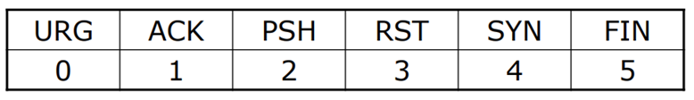

- URG – задействовано поле «Указатель срочности»
- ACK - задействовано поле «Подтверждение»
- PSH – включена функция проталкивания
- RST – перезагрузка соединения
- SYN – синхронизация номеров очередей
- FIN – завершение соединения

# 13. Транспортный протокол TCP. Алгоритм функционирования.

## Установка соединения:

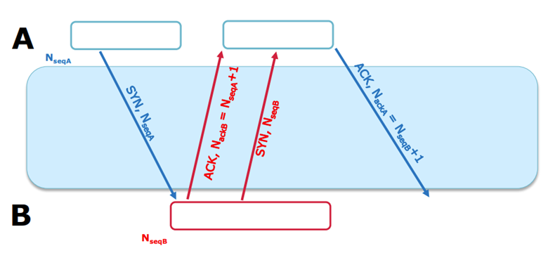

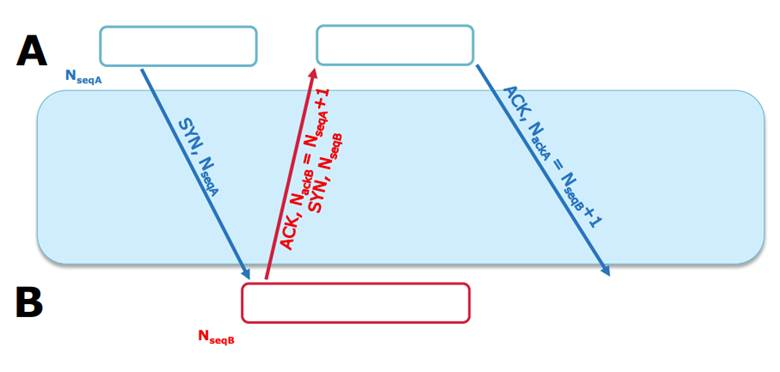

Процесс начала сеанса TCP - обозначаемое как "рукопожатие" (handshake), состоит из 3 шагов.

1. Клиент, который намеревается установить соединение, посылает серверу сегмент с номером последовательности и флагом SYN.
   - Сервер получает сегмент, запоминает номер последовательности и пытается создать сокет (буферы и управляющие структуры памяти) для обслуживания нового клиента.
   - В случае успеха сервер посылает клиенту сегмент с номером последовательности и флагами SYN и ACK, и переходит в состояние SYN-RECEIVED.
   - В случае неудачи сервер посылает клиенту сегмент с флагом RST.

2. Если клиент получает сегмент с флагом SYN, то он запоминает номер последовательности и посылает сегмент с флагом ACK.
   - Если он одновременно получает и флаг ACK (что обычно и происходит), то он переходит в состояние ESTABLISHED.
   - Если клиент получает сегмент с флагом RST, то он прекращает попытки соединиться.
   - Если клиент не получает ответа в течение 10 секунд, то он повторяет процесс соединения заново.

3. Если сервер в состоянии SYN-RECEIVED получает сегмент с флагом ACK, то он переходит в состояние ESTABLISHED.
   - В противном случае после тайм-аута он закрывает сокет и переходит в состояние CLOSED.

Процесс называется "трехэтапным согласованием" ("three way handshake"), так как несмотря на то что возможен процесс установления соединения с использованием 4 сегментов (SYN в сторону сервера, ACK в сторону клиента, SYN в сторону клиента, ACK в сторону сервера), на практике для экономии времени используется 3 сегмента.

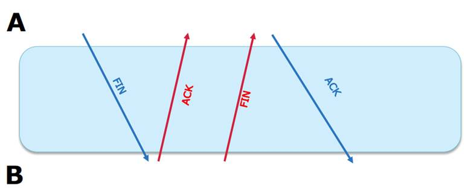

Завершение соединения можно рассмотреть в три этапа:

1. Посылка серверу от клиента флагов FIN и ACK на завершение соединения.

2. Сервер посылает клиенту флаги ответа ACK , FIN, что соединение закрыто.

3. После получения этих флагов клиент закрывает соединение и в подтверждение отправляет серверу ACK , что соединение закрыто.

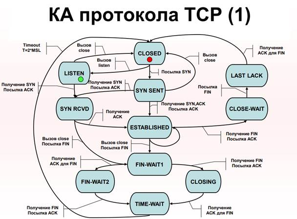

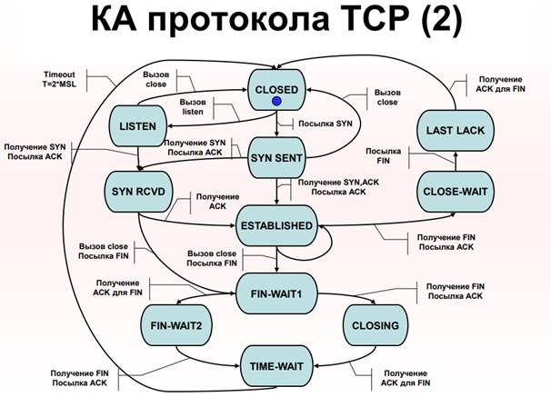

## Срочные данные:

- Срочные данные
  - Используется для немедленной доставки данных приложению на приемной стороне
  - Флаг URG – признак наличия срочных данных
  - Поле Offset – указатель на первые несрочные данные
- Проталкивание данных
  - Используется для немедленной отсылки сегмента в сеть
  - Для проталкивания устанавливается флаг PSH

## Управление скоростью передачи:

- Идея: передавать в сеть больше неподтвержденных данных
- В сеть могут передаваться сегменты, которые попали в скользящее окно
- Окно сдвигается только тогда, когда приходит подтверждение на первый посланный сегмент

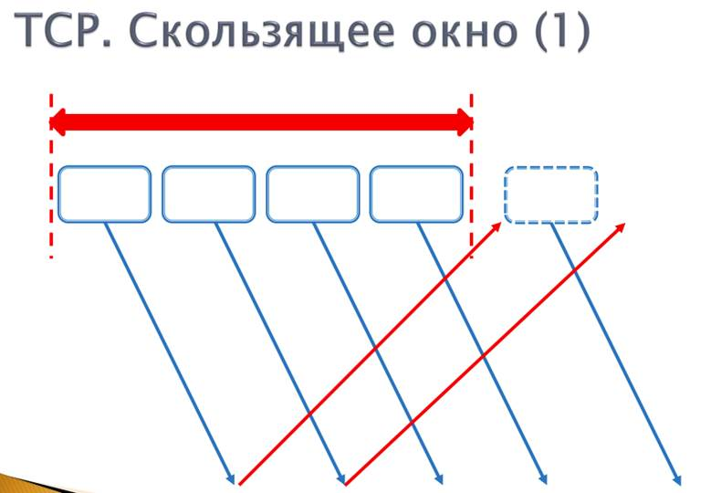

# 14. Транспортный протокол SCTP

SCTP – Stream Control Transmission Protocol (протокол передачи с управлением потоком). Относительно новый транспортный протокол.
Первым его стандартом был RFC2960, 2002г.
Нынешний стандарт RFC4960, сентябрь 2007г.

Основная идея создания протокола была объеденить в себе достоинства и исправить недостатки двух других известных транспортных протоколов (TCP и UDP).

Одними из главных нововведений SCTP были многопоточность, защита от DdoS атак и multi-homing(синхронное соединение между двумя хостами по двум и более независимым физическим каналам) (дополнительно после формата пакетов).

Целый пакет состоит из общего заголовка(12 байт=64 бита) и субпакетов (чанков). Каждый чанк же в свою очередь состоит из своего заголовка и данных.

### Формат общего заголовка:

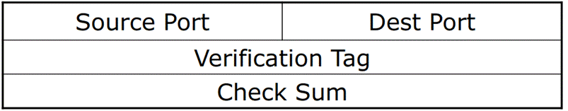

Где:

- Verification tag – метка для проверки
   отправителя пакета (32-битное случайное значение, созданное во время инициализации, чтобы отличать устаревшие пакеты от предыдущего соединения)
- Check Sum – контрольная сумма 

### Формат чанков:

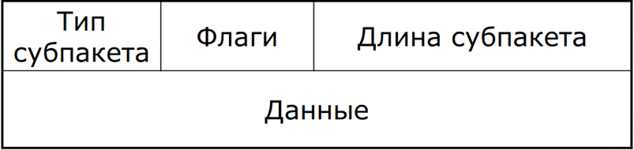

Под тип выделен один байт,значит возможно 255 различных типов. На данный момент в RFC определены 15 типов. 0 означает, что чанк несет полезные данные, остальные — служебные.

Под флаги тоже 8 бит, состав флагов определяется типом чанка.

Длина чанка — 0 ... 65535, общая длина субпакета с заголовками.

### Безопасное установление соединения:

В TCP трехэтапный хэндшейк, в чем есть одна потенциальная уязвимость, обусловленная тем, что нарушитель, устанавливая фальшивые IP-адреса отправителя, может послать серверу множество пакетов SYN. При получении пакета SYN сервер выделяет часть своих ресурсов для установления нового соединения. Обработка множества пакетов SYN рано или поздно затребует все ресурсы сервера и сделает невозможной обработку новых запросов. Такой вид атак называется «SYN-флуд».

Протокол SCTP защищён от подобных атак с помощью механизма четырёхэтапного квитирования (four-way handshake) и вводом маркера (cookie). По протоколу SCTP клиент начинает процедуру установления соединения, посылая пакет INIT. В ответ сервер посылает пакет INIT-ACK, который содержит маркер (уникальный ключ, идентифицирующий новое соединение). Затем клиент отвечает посылкой пакета COOKIE-ECHO, в котором содержится маркер, полученный от сервера. Только после этого сервер выделяет свои ресурсы новому подключению и подтверждает это отправкой клиенту пакета COOKIE-ACK.

### Многопоточность

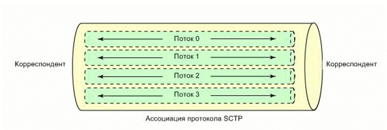

Термин «многопоточность» (англ. *multi-streaming*) обозначает способность SCTP параллельно передавать по нескольким независимым потокам *сообщений*. Например, мы передаём несколько фотографий через HTTP-приложение (например, браузер). Можно использовать для этого связку из нескольких TCP-соединений, однако также допустима *SCTP-ассоциация* (англ. *SCTP-association*), управляющая несколькими потоками сообщений для этой цели. Потоки являются однонаправленными, то есть передают информацию только в одном направлении (картинка выше является неточной). 

TCP достигает правильного порядка байт в потоке, абстрактно назначая порядковый номер каждой отосланной единице, а упорядочивая принятые байты, используя назначенные порядковые номера, по мере их прибывания. С другой стороны, SCTP присваивает различные порядковые номера сообщениям, посылаемым в конкретном *потоке*. Это разрешает независимое упорядочивание сообщений по разным потокам. Так или иначе, многопоточность является опцией в SCTP. В зависимости от желаний пользовательского приложения, сообщения могут быть обработаны не в порядке их отправления, а в порядке их поступления. 

## Другие достоинства SCTP:

**Multihoming** (Использование множественных интерфейсов, мультидомность по Ицыксоновски) - Допустим, у нас есть два хоста. И хотя бы один из них имеет несколько сетевых интерфейсов, и соответственно несколько IP-адресов. В TCP, понятие «соединение» означает обмен данными между двумя точками, в то время, как в SCTP имеет место концепция «ассоциации» (англ. *association*), обозначащая всё происходящее между двумя хостами

**Механизмы валидации и проверки подлинности -** Защита адресата от flood-атак (технология 4-way handshake), и уведомление о потерянных пакетах и нарушенных цепочках.

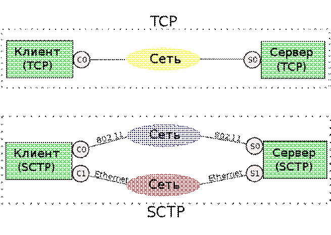

## Из недостатков

Бóльшая занимаемая полоса, то есть относительный объём служебного трафика больше, чем при использовании TCP/UDP. 

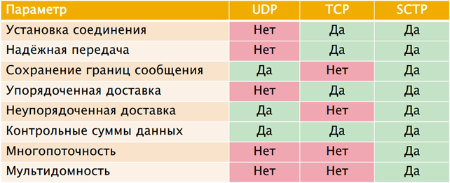

# 15. Маршрутизация в TCP/IP. Маршрутизаторы и шлюзы. Процесс доставки пакетов в сети.

**Internet Protocol** служит для пересылки ip-datagrams от ip-адреса отправителя до ip-адреса получателя (адреса при пересылке остаются неизменными, в отличии от аппаратных адресов). Маршрутизация же является ключевой функцией IP, т.к. необходима для поиска маршрутки доставки этого пакета.

### Маршрутизация

- Функция сетевого уровня
  - Заключается в поиске оптимального маршрута для доставки пакетов через сеть от ip-адреса узла-отправителя до ip-адреса узла-получателя 
  - Сбор и хранение информации о других маршрутизаторах и хостах в сети
- Маршрутизация:
  - Индивидуальная (два узел устанавливают между собой отдельный маршрут)
  - Групповая (один узел устанавливает маршруты с группой других и пересылает данные членам группы)

- В TCP/IP сетях маршрутизация является частью протокола IP (Internet Protocol) и используется в сочетании с другими службами сетевых протоколов для обеспечения передачи данных между узлами, расположенными в разных сегментах более крупной TCP/IP-сети.

### Маршрутизаторы и шлюзы

- Другие названия:
  - Шлюз
  - Router
  - Gateway
- Устройство сетевого уровня, реализующее функции маршрутизации (обеспечивающее доставку пакетов от одного узла сети к другим)
- Отличие маршрутизатора от обычного сетевого узла – пересылка входящих пакетов, у которых адрес назначения не совпадает с локальными адресами узла
- IP-forwarding. Переадресация IP, также известная как интернет-маршрутизация, представляет собой процесс, используемый для определения того, по какому пути может быть отправлен пакет или дейтаграмма. Процесс использует информацию о маршрутизации для принятия решений и предназначен для отправки пакета по нескольким сетям.
- Виды маршрутизаторов:
  - Аппаратные (маршрутизатор, router)
  - Программно-аппаратные (шлюз, gateway)

### Аппаратные маршрутизаторы (маршрутизатор)

- Особенности:

  - Поддержка различных канальных сред
  - Наличие нескольких сетевых интерфейсов
  - Высокая производительность
  - Высокая надежность
  - Хорошая защищенность
  - Дополнительные функции:
    - Фильтрация
    - Трансляция адресов
    - Сбор статистики

  - Обычно высокая стоимость

- Производители:
  - CISCO
  - Intel
  - HP
  - Dlink

### Программно-аппаратные маршрутизаторы (шлюз)

- Реализуются функциями ОС общего назначения
- Характеризуются
  - Невысокой производительностью
  - Невысокой стоимостью
  - Могут совмещать функции с обычными функциями ОС

## Процесс маршрутизации

В процессе маршрутизации на стороне отправителя данные проходят все 7 уровней модели ISO/OSI сверху-вниз постепенно инкапсулируясь на каждом из уровней. В итоге получается такой большой «конверт с конвертами», который пересылается получателю. На стороне получателя данные постепенно декапсулируются («конверт» постепенно раскрывается) на каждом уровне, пока идут снизу-вверх и пока не достигнут прикладного уровня.

- A, B – компьютеры
- R1, R2 – маршрутизаторы
- 1–7 – это уровни в OSI/ISO
- Компьютер использует все 7 уровней модели, а маршрутизатор только 3, так как их достаточно, чтобы продолжить маршрут в любой сети.

# 16. Статическая маршрутизация. Таблицы маршрутизации.

**Статическая маршрутизация** – вид маршрутизации, при котором маршруты указываются в явном виде при конфигурации маршрутизатора администратором. Вся маршрутизация при этом происходит без участия каких-либо протоколов маршрутизации. Статический маршрут хранится в таблицах до выключения. 

При задании статического маршрута указывается:

- Адрес сети (на которую маршрутизируется трафик), маска сети
- Адрес шлюза (узла), который отвечает за дальнейшую маршрутизацию (или подключен к маршрутизируемой сети напрямую)
- (опционально) метрика ("цена") маршрута.

## Достоинства:

- Лёгкость отладки и конфигурирования в малых сетях
- Отсутствие дополнительных накладных расходов (из-за отсутствия протоколов маршрутизации)
- Мгновенная готовность (не требуется интервал для конфигурирования/подстройки)
- Низкая нагрузка на процессор маршрутизатора
- Предсказуемость в каждый момент времени

## Недостатки:

- Очень плохое масштабирование
- Низкая устойчивость к повреждениям линий связи
- Отсутствие динамического балансирования нагрузки
- Необходимость в ведении отдельной документации к маршрутам

В реальных условиях статическая маршрутизация используется в условиях наличия шлюза по умолчанию (узла, обладающего связностью с остальными узлами) и 1-2 сетями.

## Таблицы маршрутизации

Атрибуты маршрутных записей:

- Сеть/узел назначения
- Сетевой интерфейс
- Маршрутизатор
- Метрика маршрута
- Флаги

**Псевдомаршруты** – дополнительные записи в таблице маршрутизации, которые используются для унификации процедуры поиска маршрута. Типы:

- Псевдомаршрут на IP-адреса собственных интерфейсов
- Псевдомаршрут на подключенные IP-сети

**Маршрут «по умолчанию»** – специальный маршрут, которые используется в случае отсутствия явных маршрутов на целевую сеть, обозначение: 0.0.0.0/0.0.0.0

Утилита route предназначена для просмотра и управления таблицей маршрутизации.

В некоторых системах поддерживается несколько таблиц маршрутизации, в таких таблицах используется коммутация **по адресу источника** – в зависимости от адреса источника выбирается подчиненная таблица маршрутизации.

# 17. Маршрутизация. Виды маршрутизации. Алгоритм выбора маршрута в РС.

[Маршрутизация - 15 вопрос](#15.-маршрутизация-в-tcp/ip.-маршрутизаторы-и-шлюзы.-процесс-доставки-пакетов-в-сети.)

Маршрутизацию можно классифицировать по нескольким признакам:

**По адаптивности**

- Статическая маршрутизация ([Вопрос 16](#16-статическая-маршрутизация.-таблицы-маршрутизации.))
- Динамическая маршрутизация ([Вопрос 17](#17.-динамическая-маршрутизация.-алгоритм-беллмана-форда-поиска-кратчайшего-пути.))
- Маршрутизация "от источника" (в зависимости от адреса источника выбирается подчиненная таблица маршрутизации)

**По месту маршрутных вычислений**

- Централизованные  (выбор маршрута для каждого пакета осуществляется сервером управления сетью, а узлы сети реализуют за данную маршрутизацию)
- Децентрализованные (управления маршрутизацией осуществляется узлами, обладающие соответствующим функционалом)

**По требуемой информации**

- Локальные (адрес локальной сети)
- Глобальные (адрес глобальной сети)
- Смешанные (обеспечивается доступ как в локальную сети, так и в глобальную)

Задача оптимальной маршрутизации –  найти оптимальный путь данных до получателя. 

Обеспечиваемая оптимальность

- Минимальное время доставки 
- Минимальная стоимость доставки 
- Минимальная задержка
- ...

При выборе статической маршрутизации адреса назначаются вручную заранее в таблицу маршрутизации, по которой и будет выбираться, на какой интерфейс отправить пакет с соответствующей адресной информацией ([Вопрос 16](#16-статическая-маршрутизация.-таблицы-маршрутизации.)).

[Динамические алгоритмы - Вопрос 18](#18.-динамическая-маршрутизация.-алгоритм-беллмана-форда-поиска-кратчайшего-пути.)

# 18. Динамическая маршрутизация. Алгоритм Беллмана-Форда поиска кратчайшего пути.

В **динамической адресации** таблица маршрутизации обновляются автоматически путем сбора информации при помощи обмена информации между служебными программами (демоны маршрутизации) на разных узлах. Таким образом динамическая маршрутизация учитывает множество изменяющихся параметров сети:

- Топология сети 
  - Появление новых узлов 
  - Появление новых каналов 
  - … 
- Каналы связи 
  - Выход из строя канала 
  - Ввод в строй канала 
- Узлы сети 
  - Выход из строя маршрутизатора 
  - Ввод в строй маршрутизатора 
- Изменение нагрузки в сети

В случае динамической маршрутизации задача заключается в поиске оптимального пути для пакета **в данный момент времени**. Задача сводится к задаче поиска пути на графе.

## Алгоритм Беллмана-Форда поиска кратчайшего пути.

### Краткое описание

Алгоритм оценивает расстояние до каждого из N узла начиная с *первого*. Оценка высчитывается исходя из веса ребра ri,j (переход между вершинами i и j). На каждую итерацию ставится ограничение переходов между узлами. В конце h-й итерации фиксируются минимальные уникальные пути D(h), i (от 1го узла до посещенного узла i) длинной не более h переходов. Перебор останавливается при достижении количества переходов равному количеству ребер (а если точнее N - 1) или если оценка перестала изменяться.

### Алгоритм

- Шаг 1. Начальные условия 
  - Граф дополняется до полного. Вес новых дуг - ∞. 
  - h := 0 
  - Вводится начальная разметка: 
    - D(h), 1 = 0
    - D(h), i = ∞, i ≠ 1
- Шаг 2. Перерасчет оценок 
  - Для всех i: D(h+1), i = minj [D(h), j + ri,j]
  - h := h + 1 
- Шаг 3.
  - Если h = N – выход 
  - Если оценки не изменились – выход 
  - Иначе – переход к шагу 2

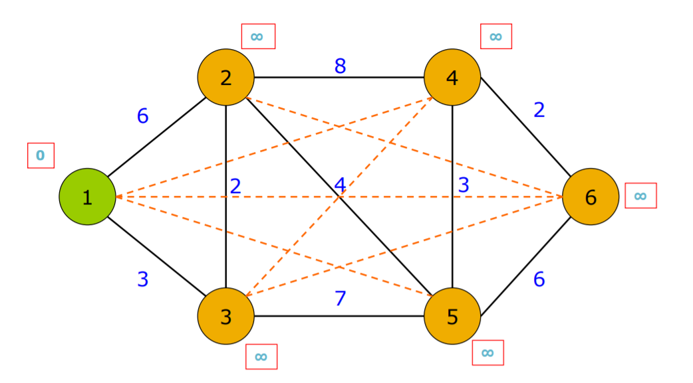

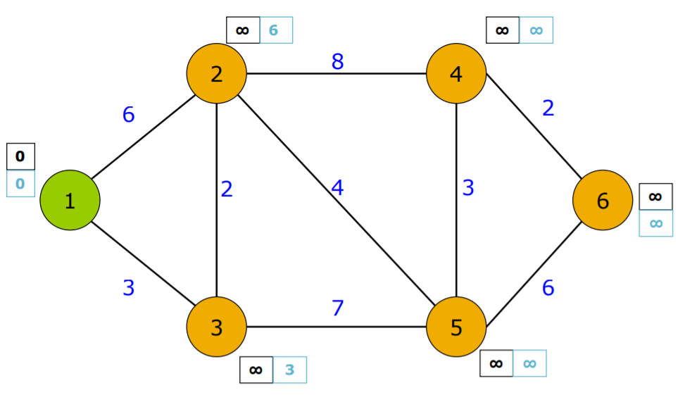

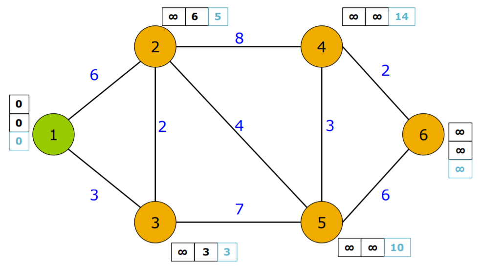

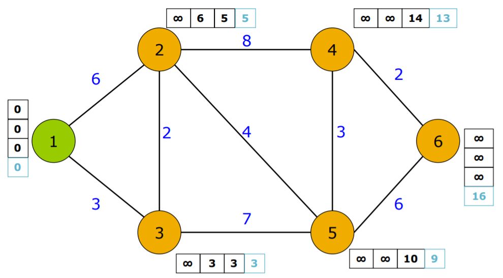

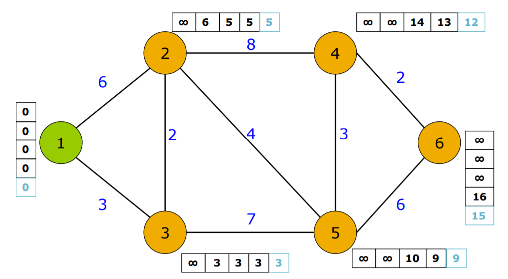

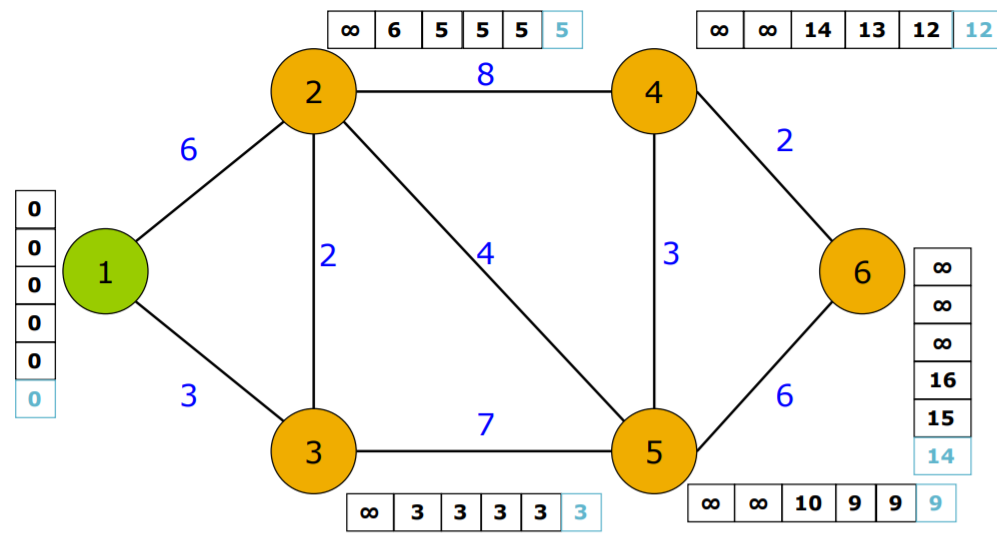

Общее число операций:

- N – число вершин 
- N-1 – число шагов 
- N – операций при минимизации на каждом шаге 
- W = O(N3) 

Достоинства алгоритма: 

- Хорошо распараллеливается 
- Просто реализуется 
- Не требует ресурсов памяти 
- Требуется информация только о соседних вершинах 
- Часто заканчивается раньше N-1 итерации 

Недостатки алгоритма: 

- В худшем случае количество операций - ~N3

# 19. Динамическая маршрутизация. Алгоритм Дэйкстры поиск кратчайшего пути.

[Динамические алгоритмы - Вопрос 18](#18.-динамическая-маршрутизация.-алгоритм-беллмана-форда-поиска-кратчайшего-пути.)

## Алгоритм Дэйкстры поиска кратчайшего пути (Shortest Path First).

### Краткое описание

Каждой вершине из V сопоставляется метка (минимальное известное расстояние от этой вершины до 1й). Изначально у 1й вершины метка равна 0, а у всех остальных бесконечности. Далее итеративно обходятся вершины. Из каждой вершины (начиная с 1й) оцениваются ребра к другим вершинам. На основании этой оценки проверяется, можно ли при помощи нового пути, включающего это ребро, сократить время до узла (новое значение сравнивается с меткой узла, если новое значение меньше - оно заменяется). Перебор заканчивается после обхода всех узлов.

### Алгоритм

- P - множество помеченных вершин (для которых найден кратчайший маршрут)
- Si – текущая оценка пути от 1-ой до i-ой 
- m – номер текущего шага

- Шаг 1. Начальные условия  
  - Множество P: P={1} 
  - Оценка пути: 
    - S1 := 0  
    - Si := r1,i 
    - m = 1 
- Шаг 2. 
  - Sn := minj Sj 
  - P := P ∪ {n} 
  - Для всех i ∉ P: 
    - Si := min (Si , Sn + rn,i) 
  - m := m+1 
- Шаг 3. 
  - Если m = N -> выход 
  - Иначе – переход к шагу 2

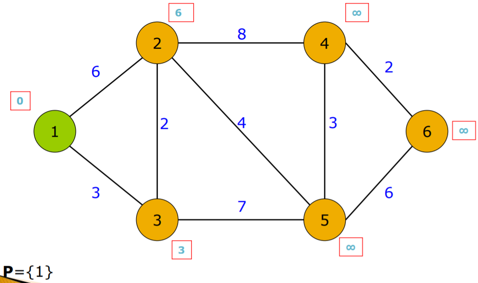

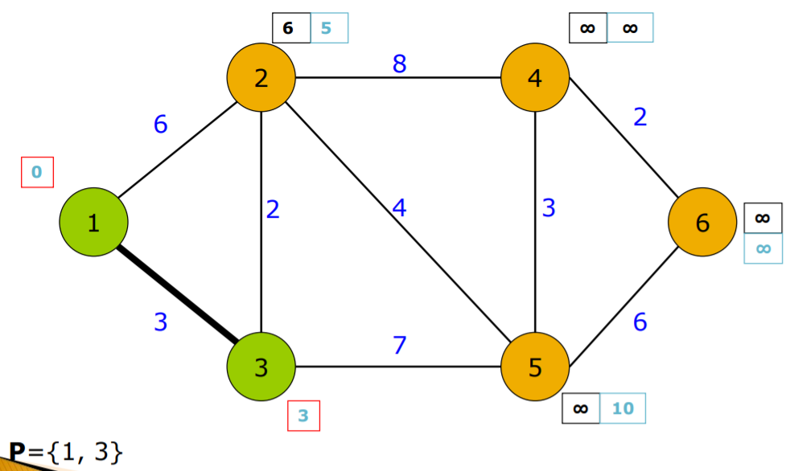

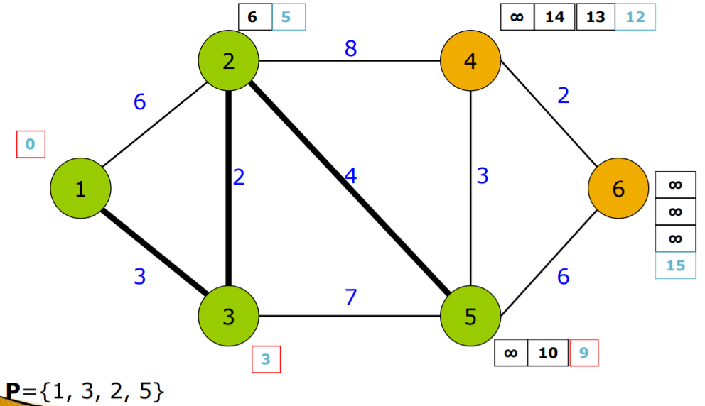

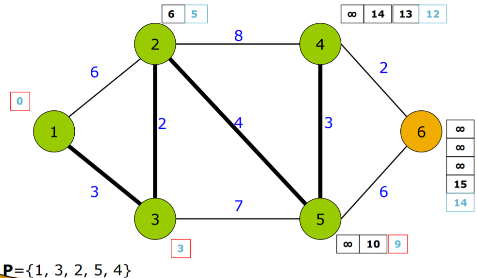

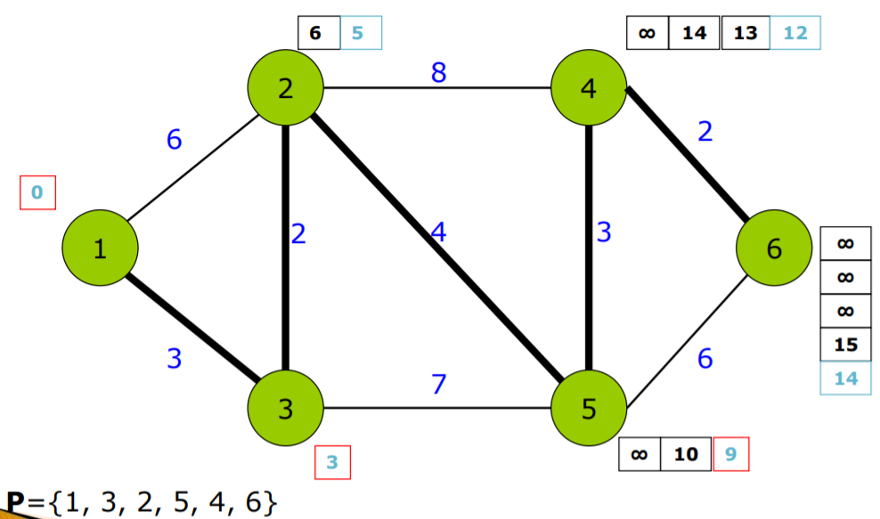

Общее число операций: 

- N-1 – число шагов  
- N – операций при пересчете оценок на каждом шаге 
- W = O(N2) 

Достоинства алгоритма: 

- Высокая скорость (~N2) 

Недостатки алгоритма: 

- Плохо распараллеливается 
- Требуется иметь информацию о топологии всей сети 
- Требует существенных ресурсов памяти (~N2)

# 23. Маршрутизация в сетях TCP/IP. Протокол маршрутизации OSPF.

**OSPF (Open Shortest Path First)** – протокол динамической маршрутизации, основанный на технологии отслеживания состояния канала (link-state technology) и использующий для нахождения кратчайшего пути алгоритм Дейкстры. Стандарт – RFC 1247, версии OSPF 1, 2, 3.

Один из основных внутренних протоколов маршрутизации. 

Протокол состояния канала - в Link-state протоколах каждый маршрутизатор должен не просто знать лучшие маршруты во все удалённые сети, но и иметь в памяти полную карту сети со всеми существующими связями между другими маршрутизаторами в том числе.

**Метрика**

Задается числом (0...65535). Отображает скорость передачи информации. 

Определение: Метрика – количество секунд, требуемое для передачи 100 Мб информации через физическую среду данной сети.

Значения по умолчанию:

- 10Base-T Ethernet - 10
- 56 кбит/с - 1785
- Метрика канала со скоростью передачи данных
- 100 мбит/с и выше - 1

Если скорость сети большая, можно задать свое значение метрики.

**Алгоритм работы:**

1) Каждый OSPF маршрутизатор периодически рассылает информацию о себе – пакеты LSA (Link State Advertisement). В них содержится информация о подключенных каналах и их состояниях (метриках). Рассылает соседям, они другим соседям и т.д. Т.о. маршрутизаторы получают информацию о всех других маршрутизаторах. LSA пакеты позволяют построить всю топологию сети, необходимую в алгоритме Дейкстры.
   - Рассылка осуществляется при изменении какого-либо канала. Другие причины: изменилось состояние интерфейса; произошли изменения в маршрутизаторе сети (или в одном из соседних маршрутизаторов); изменилось состояние одного из внутренних маршрутов; возраст маршрута достиг предельного значения (30 минут) и др.  
   - В результате лавинного обмена все узлы OSPF получают информацию обо всех каналах сети.

2) После получения пакетов все маршрутизаторы строят LSD – Link State Database (база данных всех состояний подключенных каналов («линков»)). Все базы, построенные разными маршрутизаторами, должны быть идентичны – условие корректного функционирования протокола.

3) Далее каждый маршрутизатор по LSD строит LST – Link State Tree – дерево достижимости в соответствии с алгоритмом Дейкстры. LSD одинаковые, но LST получатся разные, т.к каждый маршрутизатор в качестве корня будет использовать себя. LST в дальнейшем используется для маршрутизации.

## Таблица маршрутизации

​     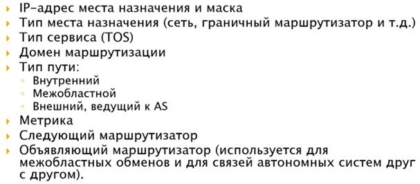

**Назначенные маршрутизаторы**

Назначенный маршрутизатор (Designated Router) – маршрутизатор, к которому, если он есть в сети, все маршрутизаторы посылают свои LSA пакеты, а он рассылает обновления всем маршрутизаторам. 

Позволяет сэкономить на лавинном обмене пакетами. 

Есть также запасной назначенный маршрутизатор (Backup Designated Router), заменяет назначенный маршрутизатор, если тот выйдет из строя.

**Транспортировка данных**

OSPF не использует транспортного протокола. Инкапсулируется непосредственно в IP (код 89).

Используется групповая передача:

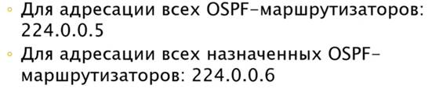

**Домены маршрутизации**

Область OSPF можно разделить на отдельные домены.

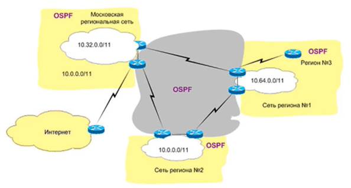

В протоколе OSPF требуется много расчетов, (количество операций на узле – N2). Если разделить область OSPF на домены, то в каждом домене будет меньше узлов, чем в общей области (например, 250 вместо 1000) => уменьшится общее количество операций на узле.

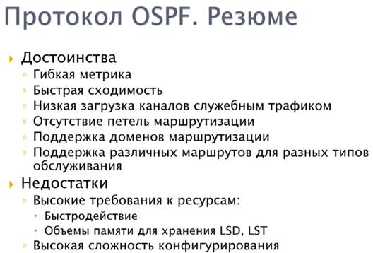

# 24. Маршрутизация в сетях TCP/IP. Протоколы **маршрутизации** **EIGRP**

**EIGRP – Enhanced Interior Gateway Routing Protocol.**  

Разработан для замены устаревшего IGRP компанией Cisco. Стандарт RFC отсутствует.

Гибридный протокол: дистанционно-векторный (алгоритм Беллмана-Форда) с элементами протокола состояния канала (алгоритм Дейкстры).

(В Distance-Vector протоколах, маршрутизатор узнает информацию о маршрутах посредством маршрутизаторов, непосредственно подключенных в один с ним сегмент сети. То есть, маршрутизатор имеет информацию о топологии только в границах его соседних маршрутизаторов и понятия не имеет как устроена топология за этими маршрутизаторами, ориентируясь только по метрикам.)

## Метрика

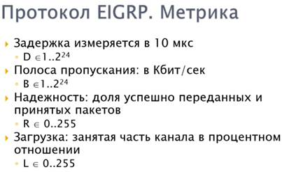

В общем случае метрика 8 байт.

Метрика сложнее и сильнее чем в других протоколах маршрутизации.

Вычисляется по формулам:

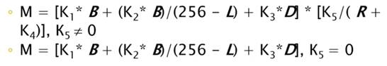

B – полоса пропускания, L - нагрузка, D - задержка, R - надежность, K1-K5 – коэффициенты, определяются пользователем.

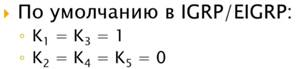, тогда M=B + D

## Обнаружение соседей

## Таблица топологии

**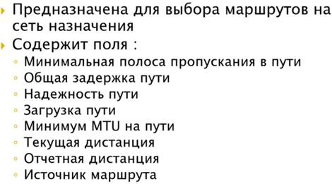**

- Минимальная полоса пропускания, т.к. пакеты с участка с большей полосой пропускания застопорятся на участке с меньшей полосой пропускания. Пример: 1000 п./с – 10 п./с – 1000 п./с, минимальная полоса – 10 п./с.
- Текущая дистанция – дистанция данного маршрута (полная метрика маршрута). Отчетная дистанция – дистанция, которую прислал узел, являющийся источником маршрута (метрика маршрута без последнего шага).

## Выбор путей

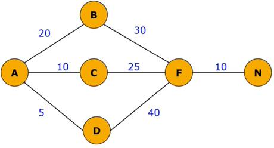

ACFN – оптимальный маршрут (самый короткий) = 45.

Заместитель: ABFN т.к. отчетная дистанция BFN = 40 < чем текущая дистанция оптимального маршрута 45. Также гарантированно здесь не будет петли.

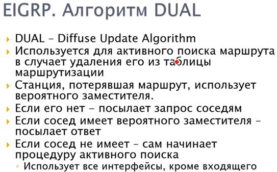

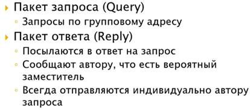

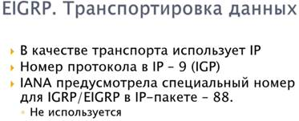

Используется групповой механизм рассылки маршрутных объявлений.

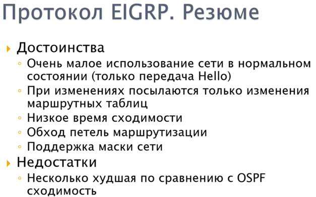

# 25. Именование ресурсов в сетях TCP/IP. Доменная система имен. 

DNS (англ. Domain Name System — система доменных имён) — компьютерная распределённая система для получения информации о доменах. Чаще всего используется для получения IP-адреса по имени хоста (компьютера или устройства), получения информации о маршрутизации почты, обслуживающих узлах для протоколов в домене (SRV-запись).

Распределённая база данных DNS поддерживается с помощью иерархии DNS-серверов, взаимодействующих по определённому протоколу.

Основой DNS является представление об иерархической структуре доменного имени и зонах. Каждый сервер, отвечающий за имя, может делегировать ответственность за дальнейшую часть домена другому серверу (с административной точки зрения — другой организации или человеку), что позволяет возложить ответственность за актуальность информации на серверы различных организаций (людей), отвечающих только за «свою» часть доменного имени.

DNS обладает следующими характеристиками:

Распределённость администрирования. Ответственность за разные части иерархической структуры несут разные люди или организации.

Распределённость хранения информации. Каждый узел сети в обязательном порядке должен хранить только те данные, которые входят в его зону ответственности и (возможно) адреса корневых DNS-серверов.

Кеширование информации. Узел может хранить некоторое количество данных не из своей зоны ответственности для уменьшения нагрузки на сеть.

Иерархическая структура, в которой все узлы объединены в дерево, и каждый узел может или самостоятельно определять работу нижестоящих узлов, или делегировать (передавать) их другим узлам.

Резервирование. За хранение и обслуживание своих узлов (зон) отвечают (обычно) несколько серверов, разделённые как физически, так и логически, что обеспечивает сохранность данных и продолжение работы даже в случае сбоя одного из узлов.

Количество уровней не ограничено. Уровни доменов вкладываются один в другой.

Зарезервированы: example, localhost, invalid, test

Домены верхнего уровня: "." полный адрес сети интернет. Не используется

Домены первого уровня: .gov, .com, .edu, .net, .org, .mil, .int,. arpa. Были изначально. Потом добавились .uk, .ru, .fr и тд 200+ доменов

Домены второго уровня – то, что слева от точки домена первого уровня и тд.

# 26. Архитектура DNS. Рекурсивные и нерекурсивные серверы имен. Ретрансляторы.

По способу ответа на запрос 

1. Рекурсивные серверы: 
   - Самостоятельно выполняют весь поиск
   - Кэшируют полученную информацию 

2. Нерекурсивные серверы:
   - Указывают, где есть необходимая информация 
   - Не кэшируют информацию.

DNS-запрос может быть рекурсивным — требующим полного поиска, — и нерекурсивным — не требующим полного поиска.

Аналогично, DNS-сервер может быть рекурсивным (умеющим выполнять полный поиск) и нерекурсивным (не умеющим выполнять полный поиск). Некоторые программы DNS-серверов, например, BIND, можно сконфигурировать так, чтобы запросы одних клиентов выполнялись рекурсивно, а запросы других — нерекурсивно.

При ответе на нерекурсивный запрос, а также — при неумении или запрете выполнять рекурсивные запросы, — DNS-сервер либо возвращает данные о зоне, за которую он ответствен, либо возвращает адреса серверов, которые обладают большим объёмом информации о запрошенной зоне, чем отвечающий сервер, чаще всего — адреса корневых серверов.

В случае рекурсивного запроса DNS-сервер опрашивает серверы (в порядке убывания уровня зон в имени), пока не найдёт ответ или не обнаружит, что домен не существует. (На практике поиск начинается с наиболее близких к искомому DNS-серверов, если информация о них есть в кеше и не устарела, сервер может не запрашивать другие DNS-серверы.).

При рекурсивной обработке запросов все ответы проходят через DNS-сервер, и он получает возможность кэшировать их. Повторный запрос на те же имена обычно не идет дальше кэша сервера, обращения к другим серверам не происходит вообще.

Ретрансляторы: используются для сокращения внешнего трафика Кэшируют информацию всех запросов Должны конфигурироваться как ретрансляторы.

# 27. Архитектура ДНС. Прямой поиск.

#### Архитектура:

DNS (domain name system) - распределённая иерархическая система, чаще всего используется для преобразования доменного имени в IP-адрес или для обеспечения работы почтовой системы.

**Структура:**

- Вся система имеет древовидную структуру, корневой элемент которой - ".", обслуживается 13 серверами (обозначаются буквами a-m) или зеркалами этих серверов (в РФ нет корневых серверов, только зеркала).
- Всё дерево имён поделено на участки ответственности - "зоны", каждая из которых обслуживается своим сервером. 
- Сервер, который ответственен за данную зону, называется авторитетным.
- DNS-клиент всегда обращается к серверу через resolver

Для каждой зоны должно быть несколько авторитетных серверов, находящихся в разных подсетях (для надёжности):

- Первичный (один)
  - содержит оригинал информации о подконтрольной зоне (e.g. в локальной сети)
- Вторичный (несколько) 
  - содержит копии информации о подконтрольной зоне (e.g. арендованный у хостинга, у провайдера)
  - периодически обновляет информацию
  - в конфигурации вторичного сервера указывается, что делать, если первичный не отвечает

**По способу ответа DNS-серверы бывают:**

- Рекурсивные
  - САМИ выполняют всю процедуру поиска
  - Кэшируют полученный результат
- Нерекурсивные
  - Перенаправляют на сервер с необходимой информацией
  - Не занимаются кэшированием

Стоит учесть, что рекурсивный поиск - долгая и более ресурсозатратная процедура, поэтому чем "выше" мы поднимаемся, тем меньшая вероятность встретить рекурсивный сервер. Все корневые серверы (".") и все домены 1 уровня - нерекурсивные.

### **Прямой поиск:**

Пример: мы (office.school.server.ru) хотим обратиться к сайту (www.support.ibm.com). Тогда первое (некэшированное) обращение будет выглядеть следующим образом:

- Resolver на нашем компьютере обращается к сохранённому в конфигурации TCP/IP DNS-серверу
  - DNS-серверы по умолчанию имеют префикс ns, допустим, наш сохранённый - ns.school.server.ru
- ns.school.server.ru - рекурсивный. Первый его запрос - к корневому серверу ("." - e.g. a.root-servers.net)
- Корневой сервер нерекурсивен - он перенаправит нас на сервер, ответственный за домен "com"
- Обращаемся к домену "com" - он нерекурсивен, отправит нас на сервер, ответственный за ibm.com (ns.ibm.com)
- ns.ibm.com - рекурсивный - сам обращается к DNS-серверу зоны support.ibm.com (ns.support.ibm.com)
- www - последний уровень домена - ns.support.ibm.com возвращает информацию на ns.ibm.com, попутно её кэшируя
- ns.ibm.com возвращает информацию на ns.school.server.ru, попутно её кэшируя
- ns.school.server.ru возвращает информацию нам, попутно её кэшируя

При последующем обращении по тому же адресу (пока не истекло время жизни кэшированной записи) ns.school.server.ru будет сразу возвращать нам требуемый адрес. При обращении по тому же адресу после истечения времени жизни записи вся процедура будет повторена снова.

# 28. База данных DNS. Ресурсные записи DNS. Адресные записи, записи о сервере имен.

База данных DNS состоит из отдельных ресурсных записей (Resource record - RR), каждая из которых хранит определённый тип информации.
**Записи имеют следующие поля:**

- Имя
  - При неуказанном имени будет использовано предыдущее
- Класс записи (почти всегда IN - internet)
- Тип записи
  - Основные типы: A, AAAA, NS, MX, etc.
- Время актуальности
  - Время, которое запись может храниться в кэше
  - При отсутствии - значение по умолчанию 
- Параметры записи
  - Зависят от типа записи
    - При описании часто используется формат BIND
    - A: Доменное имя узла, адрес узла
      - school IN A 195.19.212.16  на сервере ns.server.ru -> school.server.ru по адресу 195.19.212.16
    - NS: Имя домена, адрес сервера имён
      - school.server.ru. IN NS 195.19.212.13 -> скорее всего, вторичный name-server для домена server.ru.

# 29. База данных DNS. Главная ресурсная запись. Маршрутизация электронной почты.

**База данных DNS** состоит из ресурсных записей – записи помогают выполнять запросы. Ресурсные записи хранят определенный тип информации, каждая запись содержит определенное количество полей.

Главная ресурсная запись **SOA** (start of authority). Предназначена для описания параметров домена. Имеет много параметров, так как является неким *паспортом* домена:

- **Имя домена** – имя домена, для которого сформирована главная запись
- **Имя первичного DNS-сервера** – сервер, который отвечает за адрес домена
- **Почтовый адрес администратора** – связь при проблемах
- **Серийный номер зоны (Serial)** – уникальный ID текущей зоны, увеличивается при изменении зоны
- **Период обновления(Refresh)** – время в секундах, как часто вторичный сервер должен обращаться к первичному
- **Время валидности данных(Expire)** – если первичный сервер не отвечает, Expire отвечает на запросы о зоне информации
- **Период повторных попыток (Retry)** - указывает задержку перед следующим обращением после неудачной попытки
- **Значение по умолчанию (DefaultTTL)** - Время жизни для всех записей в зоне

Главная ресурсная запись одна на зону.

AXFR – копируется вся зона.

## Запись о сервере эл.почты

- DNS используется для маршрутизации почты
- Почтовый домен не всегда связан с конкретным IP адресом.
- MX связывает IP- адреса и почтовые домены
- Приоритет задает желаемое качество доставки.

# 30. База данных DNS. Записи о псевдонимах, сервисах.

**Запись о псевдониме** – позволяет выдать новое имя уже известному адресу.

В реальном мире мало веб-серверов с именем www, практически всегда используется псевдоним. В конце 90-х появились веб-хостинги, в этом случае псевдоним используется как переключатель, что позволяет на одном физическом IP разместить неограниченное количество виртуальных адресов. Web-server узнает, к которому узлу обращаться благодаря особенностям http (URL хранится в заголовке http).

НЕ ИСОЛЬЗУЮТСЯ ДЛЯ МАРШРУТИЗАЦИИ ПОЧТЫ

## Запись о сервисе

Запись анонсирует наличие сервиса и его местонахождение. Запись о сервисе – относительно новая запись, расширяет идею MX, делает универсальным обращение к какой-либо службе. Вес используется чтобы распределять нагрузку между сервисами.

# 31. DNS. Обратный поиск.

Если прямой поиск в DNS — по домену найти ip адрес, то обратный поиск — обратная задача: по ip адресу найти доменное имя.
Цель обратного поиска — убедиться в подлинности доменного имени, т. е. Это используется в целях безопасности. 

### Как организуется обратный поиск.

<u>Прямой поиск:</u> мы идем по дереву имён, начиная с ближайшего к нам днс сервера, а потом через корневой находим необходимый сервис в соответствии с доменным именем.

<u>Обратный поиск:</u> здесь ситуация гораздо хуже у нас нет домена, у нас есть ай пи адрес разработчики не стали разрабатывать отдельный протокол обратного днс.

Они свели задачу к уже ранее решенным и по сути для обеспечения обратного поиска используют прямой поиск.

для преобразования создан специальный домен: In-addr.arpa, который отвечает за обратное преобразование. структура имен в этом домене соответствует октетам айпи адреса в обратном порядке.

При запросе имени для адреса X.Y.Z.T строится запрос для имени:

- T.Z.Y.X.in-addr.arpa
- Такой запрос обслуживается как прямой

превращается в символическое имя, где в обратном порядке записаны десятичные октеты и получаем стандартный домен. И по нему делается запрос. По какой ресурсной записи? Ptr

### PTR

Введена новая ресурсная запись: PTR. Обратный смысл по отношению к адресной записи. Задача – показать каким именам соответствуют какие имена. 

Обеспечивает преобразование имен из домена in-addr.arpa. в доменное имя 

Запись PTR: Использовано для обратного преобразования имен из домена in.addr.arpa в доменное имя. 

<u>Параметры:</u>

1) Имя узла – перевернутый ip адрес. 

2) Доменное имя узла 

<u>Формат bind</u> - in-addr-name IN PTR name

<u>Примеры:</u> 11.12.19.195.in-addr.arpa. IN PTR ya.ru. - Адресу 195.19.12.11 соответвует ya.ru

16 IN PTR office.school.server.ru - Для всей сети класса с описать обратное преобразование, можно использовать только последний октет. 

### Система bind

Самая популярная система организации днс в мире. эта система разработана очень давно. изначально в университете беркли. Предназначена для организации базы данных днс.

 Если хотим организовать систему днс, обслуживающие домен: 

1) Создаем главный файл конфигурации. Описываются все зоны, которые ведутся данным сервером. Типы зон – первичный (сами отвечаем за эту зону ) и вторичная (копируем данные с первичного)

2) Файл прямого преобразования. Для зоны, которую мы ведем, содержатся все адресные записи, записи о name сервере, записи soa(главная запись домена) , необходимое число записей mx/ cname

3) Файлы обратного преобразования. Должно быть столько, сколько обратных зон. В нем записи soa, ns, ptr,  

4) Файл кэша корневых серверов. Файл, где указаны текущие ip адреса 13 корневых серверов. 

5) Файл обратного преобразования для локальной зоны – 127 0 0 1, если хотим получить обратное имя, то должны завести зону, где будет единственная запись, и выдавать localhost

Чтобы DNS заработал нужно правильно зарегистрировать зону, правильно проделегировать права и т д. 

### Проблемы: 

1) если я хочу полностью ввести систему днс. то мне нужно отдельно ввести прямой домен (school.server.ru). Я должен завести домен, авторитетный сервер, завести в нем первичные вторичные днс серверы, которые отвечают запросы. но если я хочу чтобы работало обратное преобразование, я должен еще завести еще одну зону, но например в данном случае зона 12 19 195.in-addr.arpa и в ней тоже завести несколько днс серверов которые отвечают за эту зону и тоже правильно зарегистрировать и делегировать. 

<u>Вопрос:</u> Если не одна сеть класса с, а например 10. Доменное имя у всех одно? Как сделать, чтобы обратный днс тоже работал? Какие зоны нужно ввести?

**Для прямого:** 2к пк в сети. В файле прямой зоны (schoolserverru) будет 2.5к запись. Слева один домен, справа 10 сетей класса с. 

**Для обратного:** нужно будет сделать 10 зон для каждого класса сетей.  

<u>Вопрос:</u> Маленькая компания. Всего 16 ip адресов. Как ввести свою обратную зону? Не могу ввести, так как ей пользуются другие. Что делать? Провайдер должен предоставить. Но если часто меняем ip адреса, то постоянно дергаем провайдера

# 32. DNS. Динамические обновления; нотификации об изменениях; инкрементальные обновления.

## Динамические обновления:

**Причина появления:** наличие динамических систем управления адресами DHCP

DNS Dynamic Update – RFC 2136

Позволяет внешним авторизованным источникам менять адреса.

**Принцип работы:** Авторизованный клиент посылает DNS серверу запрос об изменении информации о ресурсной записи. Если сервер не первичен, то запрос пересылается наверх. Когда дошли до первичного DNS, то первичный сервер модифицирует свою базу данных, изменяет серийный номер зоны. Через какое то время вторичные серверы получают от первичного обновленную информацию.

## Нотификация об изменениях:

Асинхронное информирование об изменении информации.

Раньше вторичные серверы получали информацию от первичных синхронно, то есть, в соответствии с записью зоны синхронно получали обновление. Это не всегда удобно, хотелось бы получать уведомления об изменениях, данных от первичного сервера как можно раньше. Например, в случае динамических обновлений, надо чтобы эту информацию быстро узнал интернет.

DNS Notify – RFC 1996

Если включена эта опция, то первичный сервер посылает обновление всем известным ему вторичным серверам. Далее вторичные посылают другим вторичным. Каждое сообщение об нотификации подтверждается. Когда дошли «до конца» , вторичные серверы осуществляют запрос зоны как при периодическом обновлении.

## Инкрементальная передача зон (инкрементальные обновления):

Классический DNS передавал всю зону. То есть если что-то изменилось, то первичный передаёт вторичному весь огромный файл зоны, сколько бы там записей не было. При динамических обновлениях происходит слишком много трансферов зон.

Для уменьшения передаваемой информации, передаётся только инкремента (приращение) зоны, вместо всей зоны. В запросе вторичный указывает серийный номер зоны, которая у него есть, а первичный вычисляет разницу содержимого и высылает её.

Тип запроса изменяется на **IXFR**.

# 33. Автоматизированная настройка параметров. Протоколы BOOTP и DHCP.

## Управление сетевыми параметрами.

Два подхода:

1) Ручная настройка: вручную задаются IP адреса, маски, DNS серверы и прочие маршрутизаторы.

2) Автоматизированная настройка: перечисленные выше параметры настраиваются автоматически либо автоматизировано.

Идея автоматизированной настройки пришла от того, что когда имеется большая компьютерная сеть, то снабжать всех пользователей инструкцией как и что надо настроить, для администратора становится очень сложно. Тем более при изменении, какого либо параметра придется объяснять ещё раз. Появилась идея сделать так, чтобы компьютер сам настраивал параметры забирая их из сериализованного хранилища.

Для этого было разработано несколько протоколов:

- RARP (Reverse Address Resolution Protocol) – устаревший протокол

- BOOTP (Bootstrap Protocol) – устаревший протокол

- DHCP (Dynamic Host Configuration Protocol)

## RARP:

Описан в RFC 903

Принцип работы: в сети должен быть RARP сервер, при включении в сеть клиент делает запрос на этот сервер. В ответ приходит IP адрес и присваивается сетевому адаптеру. Разделяет один формат пакетов с ARP.

Используется только для получения IP, чего недостаточно в современных сетях.

## BOOTP:

Описан в RFC 951, 1533, 1542

Принцип работы: в сети должен быть BOOTP сервер. В момент, когда бездисковая или автоконфигурируемая станция собирается загрузиться, делается широковещательный запрос по протоколу BOOTP к этому серверу. BOOTP :

1) IP адрес.

2) Маска сети.

3) Маршрутизатор по умолчанию. 

Выдается достаточно параметров, чтобы компьютер стал автономным, и всё остальное, при необходимости, мог загрузить из сети.

Протокол позволяет делать цепочку BOOTP ретрансляторов до BOOTP сервера. То есть, если в вашей сети нет BOOTP сервера, то отправляется запрос к BOOTP ретранслятору, ретранслятор отправляет запрос дальше, пока не будет достигнут BOOTP сервер и не будет получена информация.

Реализация: у BOOTP сервера имеется статическая таблица соответствий MAC адресов и параметров узла. То есть, администратор, когда хочет сконфигурировать BOOTP сеть, то заходит на сервер, и, зная все компьютеры в сети, для каждого из них прописывает необходимые параметры.

## DHCP:

Протокол разработан компанией Microsoft

Описан в RFC 2131, 2132

Разработан не как самостоятельный протокол, а как расширение BOOTP протокола. Все новые, получаемые дополнительно поля, располагаются в поле опций протокола BOOTP.

Поддерживается 3 режима:

1) Ручное распределение адресов: точно такое же, как в BOOTP, администратор пишет соответствие MAC адресов и выдаваемых параметров.

2) Автоматическое распределение: формируется пул адресов, которые раздаются клиентам по мере их подключения. После чего выданные данные заносятся в таблицу, и в будущем никому кроме выбранной станции, адрес не выдается. Количество подключаемых станций соответствует количеству свободных адресов. Не подходит для современного интернета.

3) Динамическое распределение адресов: адреса не закрепляются за конкретным устройством навсегда, выдаются в аренду, по истечению срока аренды, адрес становится вновь свободным и может быть выдан любому устройству, которое захочет подключиться.

Информация передается через опции протокола BOOTP.

### Типы опций:

1) Базовые параметры:

   - маска сети

   - default gateway (маршрутизатор по умолчанию)

   - DNS сервер

   - название вашего узла (текстовое)

   - название домена по умолчанию

2) Параметры узла:

   - IP forwarding

   - Default TTL

   - и так далее

3) Параметры интерфейсов

   - MTU (maximum transfer unit)

   - Broadcast

   - Static routes

4) Параметры TCP:

   - TCP default TTL

   - KeepAlive time

   - И тому подобное

5) Параметры приложений:

   - NIS, NIS+

   - WINS

   - POP3, SMTP, NNTP

6) Параметры аренды:

   - Запрашиваемый IP

   - Срок аренды

   - Идентификатор сервера, который сделал эту аренду

   - и тому подобное

Для управления арендой есть утилита ipconfig

# 37. Управление в сетях. Протокол SNMP.

Модель систем управления компьютерными сетями:

Классическая модель ISP/OSI ( ITU – T X.700 ) рассматривает 5 задач управления:

1) Управление конфигурацией

2) Управление учетом использования ресурсов

3) Управление неисправностями

4) Управление эффективностью

5) Управление защитой

Архитектура систем управления сетями:

1) Management entities: управляющие элементы, управляющие программы, в задачи которых входит управление другими устройствами.

2) Managed devices: управляемые устройства, которые должны в своём составе иметь:

   - Управляющий агент, через которого management entities управляет устройством

   - Управляющая БД, которая проецирует сетевые параметры на стандартные схемы представления параметров в современных протоколах

3) Management proxies: посредники управления, используются когда управляемое устройство очень «глупое» , то есть само не может реализовывать элемент архитектуры, тогда для этого нужен посредник.

   - Управляющий агент

   - Управляющая БД

4) Management environment: среда управления, та компьютерная сеть, по которой происходит передача управляющих команд. В современных компьютерных сетях, это одна и та же среда, что используется для прикладных задач
   - Обычно используется прикладная КС

### Архитектура систем управления сетями

Основная задача, которая реализуется – задача управления конфигурацией.

### Управление конфигурацией:

1) Контролирование информации о сетевой и системной конфигурации.

2) Управление программными компонентами

3) Управление аппаратными компонентами

Реализация архитектуры в TCP/IP сделана с помощью протокола SNMP

## SNMP (Simple Network Management Protocol):

Первый стандарт 1988 г. Является основным протоколом управления в TCP/IP.

### Стандарты:

- RFC 1157
- RFC 1441-1450, RFC 1901-1910, RFC2263-2265, RFC 2273-2275, RFC 2573-2575
- RFC 3411 – 3418

### Существует три основных версии протокола: 

1) SNMPv1,

2) SNMPv2 (v2c, v2p,v2u – реализуют разные методы аутентификации) 

3) SNMPv3

Цель: хотим с помощью одного универсального протокола управлять разными устройствами: коммутаторы, маршрутизаторы, серверы, NAT серверы, web серверы, системы защиты информации и так далее. Поэтому необходимо общее представление управляющих команд.

Для этого была придумана общая среда – база управления MIB (management information database). Эта база представляет все задачи управления в виде дерева переменных, которые одинаковы для всех устройств, которые используются. Также SNMP устройства должны представлять информацию в виде этого дерева переменных. То есть SNMP агент на управляемых устройствах должен понимать это дерево переменных, и в таком виде отдавать данные SNMP менеджеру и отвечать в таком виде на запросы SNMP менеджера.

### Концепция переменных:

1) Операция чтения переменных

2) Операция записи переменной

3) Операция чтения следующей переменной (в случае если переменная списочная)

### Переменные:

1) Скалярные

2) Таблицы

## Протокол SNMP:

1) Независим от транспортного протокола, однако обычно используют UDP

2) На уровне представлений используется нотация ASN.1 Basic Encoding Rules, для кодирования сообщений для передачи по сети.

3) Порт управления – 161 (передача команд от менеджера к агенту)

4) Порт уведомлений (snmp trap(ловушки)) – 162 (сообщение менеджеру о чём-то, что произошло в управляемом устройстве)

5) Концепция «ловушек» - при нештатной ситуации менеджер оповещается об этом

### Часть дерева системы MIB

Используется не только для интернета, а во всех телекоммуникациях.

## Объект SNMP:

1) Текстовое имя

2) Тип объекта

   - Network address

   - IP address

   - Counter (счетчик со сбросом)

   - Gauge (счетчик без сброса)

   - Ticks (для измерения временных параметров

   - Opaque (строки)

3) Определение объекта

4) Доступ к объекту

   - Read-only

   - Write-only (для подачи управляющих команд)

   - Read-write

   - No-access

5) Статус

   - Обязательный (переменная должна быть реализована в любом устройстве) 

   - Необязательный

   - Устаревший

## Безопасность протокола SNMP:

1) Модель безопасности на основе сообществ 

   - Вводится понятие сообщества, нешифруемая строка, которая используется в запросе менеджеру, если строка совпадает, то можем подавать управляющие команды.

   - Используется:
     - SNMPv1
     - SNMPv2c
2) Модель безопасности на основе сторон
   - Вводится понятие стороны:
     - идентификатор стороны
     - логический сетевой адрес
     - протокол аутентификации и связанные параметры
     - протокол шифрования и связанные параметры
   - Используется:
     - SNMPv2p
3) Модель безопасности на основе пользователей

   - Вводится понятие пользователь
     - идентификатор пользователя
     - протокол аутентификации
     - протокол шифрования
     - ключи шифрования
     - ключи аутентификации
   - Используется:
     - SNMPv2u
     - SNMPv3 

# 38. Электронная почта. Механизм работы. Система MIME.

###  Электронная почта

* Формат почтового адреса: **name@host.domain**  

На самом деле адрес электронной почты может быть почти любым.  Но обязательно должна быть **одна собака** и **хотя бы одна точка** (не может быть адрес **name@ru**)

* Формат сообщения (RFC 822): Гарантирует, что передаются **только текстовые данные** (остальное не гарантируется, так как в сети могут быть сервера которые не поддерживают например символы национальных алфавитов. 

Для того чтобы поддерживать не только текстовые данные разработано **расширение MIME**

### Механизм работы

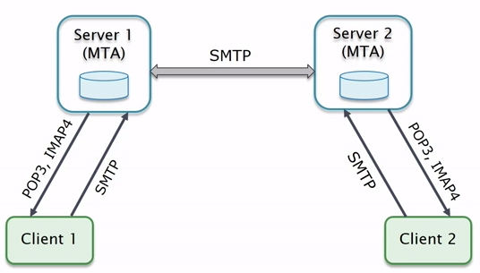

Сервер передачи почты (MTA — mail transfer agent) — взаимодействуют с другими серверами по **SMTP**

1. Клиент обращается к серверу электронной почты тоже по **SMTP**, а для получения почты по протоколам **POP3** и **IMAP4**

2. Сейчас, используется еще способ обращения почтовому серверу через web-интерфейс. Тогда клиент обращается к серверу через **HTTP**, а сервер представляет почтовые папки в виде web-страниц. **Но сообщения хранятся только на сервере**

#### Дополнение к картиночке

Картиночка: 

1. Клиент_1: отправил сообщение по SMTP
1. Сервер_1: анализирует доменную информацию выесняет к какому серверу нужно обратиться и передает сообщение на Сервер_2
1. Сервер_2: сохраняет сообщение в базу данных
1. Клиент_2: когда хочет получить почту. Скачивает ее с Сервера_2 по протоколам **POP3** и **IMAP4**   

### Система MIME 

**MIME — стандарт для передачи нетекстовой информации внутри писем**

Позваляют закодировать нетекстовую в символы текста:

* *BASE64* — выбирается 64 символа, которые гарантировано не меняются при передачи на почту.**Данные увеличиваются на 1/3**  
* *Quoted-printable* —  Каждый байт кодируется знаком `=` и шестнацатеричным кодом. **Данные увеличиваются в 3 раза**. Используют, когда нужно закодировать маленький объем информации, потому что просто

**Заголовки (вставляются в начало сообщение)**
Формат: `=? Charset ? Encoding ? Encoded-text ?=`

* *Charset* — набор символов
* *Encoding* — кодировка 
  * *B* — *BASE64*
  * *Q* — *Quoted-Printable*

# 39. Протокол передачи электронной почты SMTP.

SMTP — Simple Mail Transfer Protocol

Общая информация: 

* Клиент ↔ Почтовый сервер
* Почтовый сервер ↔ Почтовый сервер
* Использует TCP порт 25
* **Не поддерживает шифрование**
* [Самая большая проблема протокола] **Базовая версия не поддерживает аутентификацию**   
* **Тектовый протокол** (Сообщения об  ошибках тоже, чтобы можно было отлаживать протокол)

### Формат сообщения об ошибках

Формат: *XYZ text message*

* **XYZ** — код сообщения 
  * *X* — тип сообщения
    * 1 — информационное сообщение
    * 2 — сообщение об успешной операции
    * 3 — предупреждение
    * 4 — ошибка на стороне клиента
    * 5 — ошибка на стороне сервера
  * *YZ* — номер сообщения внутри типа ошибки(*X*)
* **text message** — тектовое описание сообщения или данные

### Команды

1. Соединение (ответ либо все ок, либо нет)
1. `HELO <домен>` — если домен правильный и сервер может передавать сообщения, то ок, иначе ошибки
1. `MAIL FROM: <почтовый адрес>` — Сообщаем от кого сообщение
1. `RCPT TO: <почтовый адрес>` — Кому сообщение
1. `DATA` — передача сообщения
   * Сервер ответит *warning* с сообщением, что нужно ввести тектс и **закончить . на пустой строке**
   * Дальше в тот же tcp-сокет помещается сообщение от клиента
1. [не обязательно] `NOOP` — проверка, что соединение живо
1. [не обязательно] `QUIT`

Для поддержки аутентификации появилась расширенная версии протокола **ESMTP**

### Команды ESMTP

1. `EHLO` — поддерживает ли сервер расширенный набор команд
1. `VRFY <почтовый адрес>` — можно проверить на существование почтовый адрес
1. `EXPN <список рассылки>`— кто входит в список рассылки

**Сейчас последние две комады запрещены**, потому что спамеры могут получить все существующие адреса

Для нормальной аутентификации появилось расширение для **SMTP** 

1. Клиент: отправляет `EHLO` 
1. Сервер: отвечает какие команды аутентификации он поддерживает

* Аутентификация командой `AUTH <Механизм> [<строка>]`
* Или Секция команды `MAIL FROM: <адрес> AUTH=строка` (используется в доверительный сообществах) 
* Или **POP3 before SMTP**, так как **POP3** имел аутентификацию, то человек аутентифицировался, а потом не закрывая сокет соединялся с сервером

# 40. Маршрутизация почты. Методы борьбы со спамом.

Электронная почта сама по себе не маршрутизироваться, потому что она маршрутизируется средствами TCP/IP, то есть почтовый сервер получив запрос от клиента на посылку электронной почты сам соединяется с целевым сервером. 

Почтовый **трафик** может быть довольно таки **большой** и может существенно **забивать** канал. Была одна очень неприятная история в начале 2000 х годов с компанией P&G компания одна из крупнейших в мире компаний. у них по моему сейчас работает чуть ли не 900 тысяч человек и гигантская корпоративная сеть даже в начале 2000 х это была огромная компания сотни тысяч сотрудников. история была следующая что какая то секретарша в какой то момент решила по корпоративной почте послать письмо о том что у нее будет вечеринка но и по ошибке вместо того чтобы послать письмо десяти своим подругам она воспользовалась адресом все клиенты P&G. Ну и несколько сотен тысяч человек получили письмо личного содержания о том что будет вечеринка. Многие возмутились ответили секретарше что вообще то недопустимо использовать адрес рассылки общей для посылки писем личного характера, чтобы больше она так не делала. причем примерно %10 из тех кто и ответил они точно так же как она ошиблась и ответили на общую рассылку. И после этого была еще.  В ответ на это возмущенные пользовались стали писать что не нужно использовать письма для личных целей корпоративную почту и тоже примерно 10 процентов из них ответила кнопка ответить всем в том числе в эту самую рассылку. В итоге в корпоративной почте P&G одновременно существовала. Миллиарды писем одинакового содержания которые заняли весь трафик P&G и все серверы только и занимались тем что передавали электронную почту между собой. это на несколько дней вывела из строя все коммуникации компании P&G. у нее был полнейший электронный коллапс. пока администраторы не смогли собственную рассылку этих миллиардов писем остановить и очистить почтовый сервер то есть даже такое простое не преднамеренное действие действие если оно сделано не слишком умно может привести к тому что электронный трафик электронной почты может забить основные каналы. 

По этому поводу необходимы механизмы как это самый трафиком управлять чтобы можно было **трафик электронной почты пускать отдельно по тем каналам которым хотелось бы его послать.** ну и подход здесь примерно следующий: 

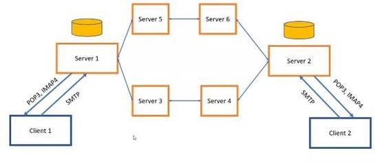 

В одну сторону почта ходит. По такому маршруту в другую сторону почта ходит по такому маршруту и специальный маршрут выбран таким образом чтобы например не забивать обычной магистрали а использовать для них например какие то дешевые но может быть не самые быстрые каналы. То есть подразумевается что мы имеем в данном случае два маршрута один маршрут из сервера 1 в 3 в 4 во 2 и один маршрут из 2го сервера в 6й в 5 в 1ый, в этом случае мы можем разделить трафики и управлять им в зависимости от корпоративной политики, в зависимости от типологии сетей и так далее и так далее. 

Как это технически сделать.  

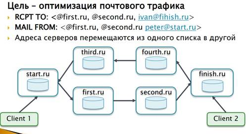 

Есть расширение SMTP которая называется SMTP маршрутизация, сделано следующим образом, изменяется формат адреса назначения, если раньше в **RCPT TO** у нас был только адрес назначения то теперь перед ним через запятую добавляются список почтовых сервисов через который мы хотим послать почту. например здесь написано что для того чтобы посылать в домен gmail, мы сначала должны послать в сервер first, а он должен послать сервер second. и обратная система **MAIL FROM** будет постепенно помещаться те адреса через которые уже почта прошла. то есть поместив изначально нужный список адресов команда **RCPT TO** мы управляем как будет идти почта в одну сторону и если специально сконфигурировано не будет, то обратно она пойдет ровно в обратном направлении потому что в **MAIL FROM** указаны все те маршруты через которые данное почтовое сообщение прошло. 

При работе с электронной почтой не всегда это является проблемой. иногда трафик почты по умолчанию так же как делается и в обычном маршрутизации. но принципиальная возможность есть. Протокол поддерживать есть необходимость маршрутизации почты есть, то это можно реализовать. вот наверное основные расширения протокола SMTP. 

<u>**Вопрос**: Откуда взялся спам. почему он вдруг появился?</u> 

**Ответ**: хотят делать дешевую рекламу. То есть основная причина спама в том что технологии электронной почте позволяют очень дешево рассылать рекламу очень большому количеству людей. 

 Например бумажный спам в почтовый ящик кинули. его нужно напечатать он стоит денег пусть небольших но стоит денег. например какая нибудь компания захочет сделать рассылку. например компания по доставке пиццы захочет например по всему петербургу разослать такие сообщения бумажные. ей придется напечатать пять миллионов этих самых баннеров и это будет на самом деле очень дорого.  При этом же если они делают спам рассылку - то это очень дешево. 

**Вопрос** как можно от спама защититься? 

Идея следующая давайте мы заставим спамера выполнять ресурс съемки вычисления. например мы будем каждый кто хочет послать мне письмо он должен будет вычислить какую то сложную функцию или выполнить какую то другую сложную операцию которая кушает определенное время его почтового сервиса. Например **каждый кто будет посылать письмо мне должен например потратить например одну секунду машинного времени** например современного компьютера. Стандартная рассылка 10 миллионов адресов а где я возьму ресурсов на то чтобы сделать 10 миллионов секундах расчетов. это дикая вычислительная мощность требуется для этого всего. поэтому для меня обычного пользователя это абсолютно бесплатная вещь. мой почтовый сервер или мой клиент например вычисляют какую то функцию. это заметили только тогда когда рассылки массовые рассылки на сотни тысяч миллионы адресов и в этот момент выяснится что эта операция перестанет работать. Сейчас разрабатывается определенное количество протоколов. Единственное что начинает работать только в тот момент когда **весь мир** переходит на такие почтовые сервисы которые требуют выполнения этих самых тяжелых операций. сейчас же используются другие способы борьбы со спамом и мы на следующей лекции с вами об этом поговорим.  

Серьезно озаботились борьбой со спамом примерно в конце прошлого - начале этого века, когда это стало серьезной проблемой и было одновременно разработано несколько технологий которые серьезно помогают в этом. 

Первая технология это **SPF**(Sender Policy Framework), была выпущена в 2003-ем году, и почти одновременно Microsoft предложила свою похожую технологию, которая называется **Caller ID for E-mail** (2004 г). В итоге, между собой смогли договориться и объединенная технология, которая называется **Sender ID**, вошла в стандарты Internet. В 2006 году вышла серия RFC 4400, четыре RFC, и это сейчас один из новых методов борьбы со спамом. На самом деле, не совсем со спамом, а с **mail spoofing**-ом. 

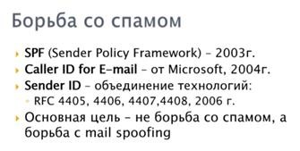 

Что такое mail spoofing. **Mail spoofing** – это когда кто-то использует какие то разные слабости в протоколе, в настройке серверов или еще в чем то и посылает вам письма от чьего-то имени, то есть это подделка исходного адреса письма. Для чего это делается? Если бы спамер присылал почту все время с одного адреса, то мы бы просто отфильтровали этот адрес и спам бы не получали. Это было бы слишком просто. Поэтому спамерами было придумано, что спам приходит каждый раз с разных адресов и сами эти адреса могут быть от разных почтовых серверов, разных ящиков и так далее. И просто так простым фильтром это невозможно отфильтровать. И все это работает, потому что из-за особенностей организации протокола SMTP, а также из-за особенностей организации самих серверов, можно относительно несложно послать письма от чужого имени. Когда в протоколе SMTP не было аутентификации, это было совсем просто. Сейчас, когда есть аутентификация, это сложнее, но тоже возможно сделать. 

В итоге, что из себя представляет эта технология (**Sender ID**), в чем же заложена идея. Когда мы получаем спамовские письма, мы их получаем, как письма с каких-то несуществующих или непонятных адресов, а может быть даже с существующих, но с известных доменов. 

Идея в следующем - а давайте-ка мы сделаем некий сервис, где владелец домена публикует в открытом доступе те адреса, с помощью которых можно отправлять почту от имени данного домена. 

Например, есть сервис mail.ru. Если кто-то хочет отправлять почту с сервиса mail.ru, он должен отправлять её исключительно с нескольких IP адресов. Например, у Mail.ru есть официальный сервис, с помощью которого можно посылать почту, он называется, по-моему, SMTP mail.ru или ещё MXS mail.ru, ну несколько всего адресов, которые обслуживают домен mail.ru. И вот только с них можно будет посылать почту от имени пользователя mail.ru. 

Чем это упростит жизнь нам? Тем, что у нас не получится так, что мы можем воспользоваться особенностями протокола SMTP, тем, что отсылающий сервер никак не связан с доменом почтовым, от которого идёт отсылка. Если вы вспомните протокол SMTP, мы пишем **MAIL FROM**, **RCPT TO** и всё. И этот MAIL FROM может быть, собственно, с любого домена. И вот как раз так с этой особенностью хочется бороться. 

При этом, получатель, получив сообщение, по заголовкам письма смотрит что, например, письмо с обратным адресом с mail.ru пришло с таких-то IP адресов и смотрит, разрешенные эти адреса были или нет. Если адреса разрешенные, то письма мы получаем, если нет, то не получаем. 

Соответственно, появляется такая сущность как PRA (Purported Responsible Address) - предполагаемый адрес отправителя, ну и задача почтового сервера - это извлечение из текста письма этого самого PRA, и последующая проверка его на валидность. 

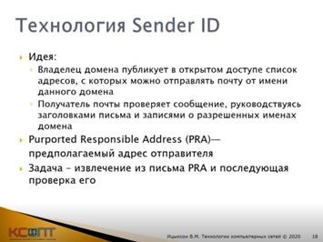 

Вопрос следующий, а где хранить вот эти вот разрешенные домены? У нас, например, почтовый сервер, тот же mail.ru, где нам хранить IP адреса тех серверов, с которых мы считаем, что валидно принимать почту от нас? 

Где-то в облаке возможно, в пространстве пользователя? 

Видите, в чём дело, речь идёт не о пользователе, а о сервере, то есть мы не для одного пользователя говорим, а для всего почтового домена, в данном случае mail.ru. И мы должны хранить это в таком месте, чтобы это место было доступно всем другим почтовым сервисам. Не знаете ли вы такой базы данных, которая доступна всем? Для этого используются записи **DNS**. Либо используют запись TXT, либо используются некоторые другие записи, там разные технологии существуют. Собственно, поиск PRA осуществляется по цепочкам заголовков письма. Если вы посмотрите какое-нибудь письмо, которое прошло через несколько почтовых серверов, там есть такое понятие “цепочки заголовков”, через которое полетел этот сервер (пролетело письмо?). По ним, собственно, вычисляется исходный сервер, с которого было переслано сообщение, и дальше через DNS это проверяется. 

Как это делается? Во первых, не всегда этот PRA можно найти по цепочкам заголовков, но если нашли, то определяется так называемый PRD - домен предполагаемый, дальше осуществляется запрос к DNS-серверу, отвечающему за домен PRD, ну и в зависимости от ответа принимается решение о дальнейших действиях. 

Если же не найден, тут есть две политики: 

- жесткая политика - это мы просто это письмо игнорируем 
- не жесткая – отсылаем письмо на дополнительную проверку на спам. 

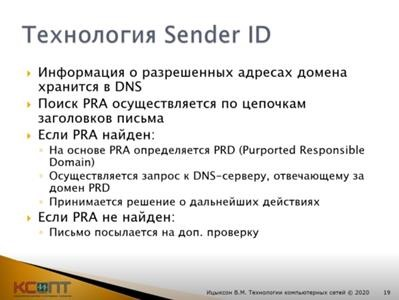 

Ну и надо сказать что технологии эти действуют. Например, компания Microsoft уже много лет их использует, и вы не сможете послать письмо на почтовый сервер DNS, если ваш почтовый сервер не поддерживает технологию Sender ID. Вы просто не сможете им послать письмо. 

Ну и это очень сильно уменьшает для пользователей поток спама. Технология стандартизирована, есть RFC, и возможность настройки технологии Sender ID есть сейчас во всех современных почтовых серверах, поэтому если вдруг с вашего почтового сервера кто-то перестал принимать почту, посмотрите в чём произошла проблема. Если действительно дело в том, что там сообщение, что не поддерживается Sender ID, надо его настроить у себя, настроить в DNS правильные реквизиты серверов и этим помогаете вашим партнёрам работать с вами не получая спам. 

Как было сказано, технология Sender ID служит для борьбы с mail spoofing-ом, а для борьбы с самим спамом используются спам фильтры. 

Обычно это довольно-таки интеллектуальные системы, сделанные с помощью технологии машинного обучения, которая использует одно большое преимущество почтовых серверов, особенно публичных почтовых серверов. В чем их преимущество, этих серверов, почему на них легко сделать фильтрацию от спама? Почему на вашем корпоративном сервере сложнее сделать фильтрацию от спама, чем на публичном сервере? Например, на яндексе сделать фильтрацию спама проще, чем на каком-нибудь почтовом сервере какой-нибудь небольшой фирмы. 

Может быть потому что больше данных приходит? 

Естественно, там ситуация очень простая. Спам, он чем хорош, одинаковое рекламное письмо отсылается огромному числу пользователей. Ну, предположим, у нас пять миллионов подписчиков в спам рассылке, предположим, из них полмиллиона попали на сервер яндекса и яндекс может проанализировав то, что одинаковое письмо или очень похоже письмо попало огромному количеству пользователей, он может с гораздо большей долей вероятности определить, что это спам. Ну а соответственно получив информацию, что одно и то же письмо или не сильно модифицированное письмо пришло большой группе, он может сделать по нему так называемый **шингл** - это слепок письма, по которому может находиться не только этот спам, но и его клоны. Спамеры они хитрые, они при рассылке не всем рассылают одинаковые письма, они рассылают похожие письма именно для того, чтобы фильтры не работали, но доступ к огромной базе пользователей, который есть в таких больших публичных почтовых серверах позволяет очень хорошо настраивать эти спам фильтры.

# 41. Протокол доступа к почтовым ящикам POP3.

Что касается получения почты. Для получения почты существуют несколько протоколов и на текущий момент используются два. 

Первый, самый простой из них, это протокол **POP-3**. Расшифровывается это как Post Office Protocol, версия 3. 

Это протокол доступа к почтовым ящикам. Вы не сможете с помощью него послать письмо. Вы сможете обратиться к почтовому серверу и просмотреть свой почтовый ящик. Протокол довольно таки старый, появился в конце 80-х, та версия, которой мы пользуемся сейчас - это середина 90-х. Он заменил устаревший протокол POP-2. Наверное, когда-то был протокол POP-1. 

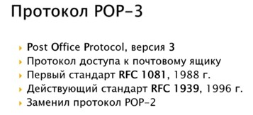 

Сам по себе протокол POP-3 – это, как уже было сказано, протокол доступа к почтовому ящику, он поддерживает функцию аутентификации пользователя ( потому что только сам пользователь, знающий логин и пароль, имеет право доступа к своему почтовому ящику), а также поддерживает несколько ключевых команд: 

- просмотр списка писем, которые в настоящий момент есть на сервере 
- копирование письма в локальный почтовый ящик, который находится на вашем локальном клиенте 
- удаление писем с сервера 

Это, собственно, основные функции, которые есть, то есть POP-3 предполагает, что **основная работа** с электронной почтой **происходит на локальном компьютере**, а сервер используют только для того, чтобы хранить вновь поступившие письма, ну или в крайнем случае архив писем. При этом, на сервере ящик представляется **одной большой почтовой папкой** (условно называющейся Inbox) и POP-3 не предполагает возможности хранения на сервере разных почтовых папок. Если вы хотите иметь много разных почтовых папок, то это всё делается на клиенте, уже средствами какогото клиента протокола POP-3. POP-3 использует **TCP**, для него зарезервирован 110-ый порт.

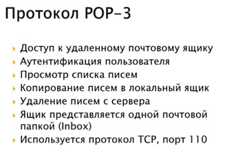 

Сам протокол POP-3 очень простой. Он использует текстовый интерфейс, но, при этом, он использует RFC формат команд, но формат ответов там не RFC, а значительно более простой. 

Формат ответов здесь – это не код ошибки и сообщение об ошибке, а два ключевых слова: ключевое слово +OK означает, что ошибки не было, ключевое слово –ERR означает, что ошибка была. 

Итак, начинается все с аутентификации. Когда клиент подключается к серверу, мы проводим аутентификацию (передача логина и пароля). 

Передача логина происходит командой **USER** с параметром “имя почтового ящика”. 

<u>Как вы думаете, какой будет ответ, если такого ящика, пользователя не существует, ok или error?</u> 

- OK 
- Почему? 
- Чтобы нельзя было узнать, что этого пользователя не существует. 
- Конечно, иначе бы это была мечта спамеров. 

Поэтому, если у нас ошибка с именем пользователя, всё-равно выдаётся OK, если правильный пользователь, выдаётся OK. ERROR выдаётся только в том случае, если мы не поддерживаем передачу пароля в открытом виде *(может, имя пользователя? Тут то мы пароль пока не передаём никакой)*. Как вы видите, в команде USER, это же просто поток TCP, имя пользователя передаётся просто в открытом виде. 

Пароль передается командой **PASS**. 

И уже здесь выдаётся OK в случае, если пара “логин пароль” правильная и ERROR, если пара неправильная. Обращаю ваше внимание, пароль передается тоже в открытом виде. Но это всё верно только для plaintext authentication. 

После того, как мы успешно прошли аутентификацию, у нас есть несколько команд: 

- команда **STAT** показывает статус почтового ящика, в котором два параметра: N и M. **N** - сколько всего писем в настоящий момент имеется в почтовом ящик. **M** - их общая длина в байтах. 
- команда **LIST** - пролистать почтовый ящик. Она выдает сначала сообщение +OK, а потом показывает список всех писем (их номера и длины). То есть вы можете посмотреть, сколько есть писем, и какой длины каждое письмо. В основном, длина писем в байтах и количество писем - это информация для почтового клиента чтобы он мог показать процедуру скачивания писем в виде красивого прогресс бара. 
- команда **LIST <N>** - это посмотреть информацию об одном конкретном сообщении. Если оно есть с таким параметром, то выдаётся его длина, если нет, то ошибка. 
- команда **RETR <N>** - это команда получения письма. По сути, команда скачивания письма. Указывается номер того письма, которое необходимо скачать и дальше, если все хорошо, то вам говорят +OK и прямо в канал TCP выкидывается всё сообщение, и, когда оно закончится, будет точка на отдельной строке. Дальше, почтовый клиент, посмотрев это сообщение, копируют его себе в локальную папку, ну и -ERR приходит, если сообщения нет. 
- команда **DELE** **<N>** - помечает сообщение на удаление. А удалять его или нет - зависит от того, как мы закончим транзакцию. 
- команда **RSET** - это сброс транзакции и сброс всех флагов сообщений. 
- команда **QUIT** - завершение транзакции и удаление всех сообщений, помеченных для удаления. 

 

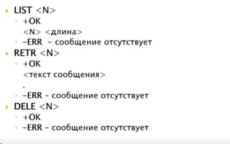 

 

Итого, подключились, прошли аутентификацию, посмотрели состояние ящика, посмотрели список писем, скачали нужные письма, удалили ненужные письма, закрыли соединение. 

Это тот минимум, который нужен для общения с почтовым ящиком. Дополнительно к этому, в RFC 96-го года появилось несколько команд, которые помогают более осмысленно работать с почтовым ящиком: 

- команда **TOP <N> <M>** - позволяет сделать маленький предпросмотр сообщения. Она показывает для **N**-го сообщения его заголовок, пустую строку и первые **M** строк сообщения (в почтовых сообщениях используется формат, что заголовок отделяется от самого сообщения пустой строкой). Таким образом, мы можем посмотреть все заголовки сообщения, не скачивая само тело сообщения. Особенно это полезное, если сообщение очень большого объема и мы даже не знаем нужно нам его скачивать или нет. 
- команда **UIDL <N>** (с параметром или без параметра) - эта команда присылает нам уникальный идентификатор сообщения с номером N, или всех сообщений, если команда без параметра. Уникальный идентификатор присваивается почтовым сервером всем письмам, которые сервер получает и он уникальный в пределах данного сервера. То есть, если у вас сервер функционирует, то каждое следующее сообщение будет отличаться идентификатором от предыдущего. Для чего это делается? Если, например, вы хотите сохранить свои сообщения не только на клиентской папке, а еще и на сервере. Зачем, кстати это нужно будет? Почему нам недостаточно хранить сообщения только на своём клиенте? Чтобы можно было с нескольких клиентов посмотреть сообщения. Действительно, если мы хотим иметь доступ с рабочего компьютера, с домашнего, и, например, с планшета, то если первый же будет забирать сообщения и удалять их, то у вас будут разные копии на всех локальных клиентах. Но, с другой стороны, если вы все сообщения храните на сервере, то они у вас там будут накапливаться, и каждый раз при соединении у вас будет показано что на сервере есть сначала 10 писем, потом 20 30 писем, 1000 писем. Но вы же хотите увидеть только новое письмо, а не все которые пришли. А POP-3 этого не позволяет делать, потому что все сообщения представлены одной папкой Inbox. Но вот, собственно, UIDL - уникальный идентификатор сообщения, как раз позволяет отличить новые от старых. Когда почтовый клиент загружает себе все сообщения, которые есть на сервере, он в том числе загружает эти идентификаторы, и в следующий раз, когда он подсоединяется к этому серверу, тот показывает ему список сообщений, мы получаем их уникальные идентификаторы и сравниваем, те, которые были, это старые, те которых не было - это новые. Ну и таким образом мы можем сказать сколько реально новых сообщений находится на сервере, ну и, например, позволить пользователю скачать только их. 

 

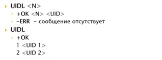 

В последних версиях протокола POP-3 есть **не plaintext** аутентификация. Аутентификация командой **APOP <имя> <дайджест>** (Authenticated POP) заменяет пару команд USER и PASS. Эта команда передает имя пользователя в открытом виде, а вместо пароля передает криптографический дайджест от этого пароля. В итоге, сам пароль почти не передается. 

 

Теперь вопрос на засыпку. А нужно ли хакеру знать сам пароль, если он может прослушивать команду APOP, увидеть имя, увидеть hash пароля и в следующий раз подсоединиться от имени пользователя с этими данными, не зная пароля? А там сервер отправляет какуюнибудь соль при этом? Да, все именно так, конечно, hash считается не только от пароля, но и от строки, которую высылает сервер. Строка примерно такого вида: 

 

В ней есть pid процесса, системный таймер и, собственно, hostname сервера. Эта строка уникальна, она каждый раз меняется и поэтому дайджест, вычисленный по паролю и по этой строке, фактически каждый раз разный. Поэтому даже если злоумышленник прослушал ваш hash, в следующий раз hash будет другой и это никак ему не поможет. 

- Ну и существует еще второй способ аутентификации. Он похож на аутентификацию такую же, как происходит в протоколе SMTP и IMAP4. В SMTP была команда **AUTH**. Здесь такая же команда **AUTH <тип аутентификации>** существует в альтернативных реализациях, как 

в SMTP. Но, насколько я знаю, используется она реже, чем команда APOP. APOP в этом смысле конечно значительно проще и по реализации, и по пониманию, и именно с точки зрения протокола все проще. А форматы для этой команды, какие могут быть типы методов аутентификации, указано в RFC 1731. 

 

Ну вот собственно и всё про POP-3, крайне простой протокол, его очень легко разработать. У него есть достоинства и недостатки: 

 

Из достоинств, понятно, это **простота реализации** и **большая распространенность**, все почтовые сервисы поддерживают этот протокол. 

Из недостатков, **трафик не шифруется**. Все ваши письма могут прочитать те, кто читает трафик. То есть нужно уже средствами почтовых программ шифровать сообщения. 

Кроме того, существует два варианта аутентификации и **один из них опасный** (через команды USER и PASS). То, что я вам не рассказал, но что является фактом, **POP-3 блокирует почтовый ящик**. То есть на время работы с почтовым ящиком клиент блокирует ящик на сервере и никакой другой клиент к нему в этот момент не может присоединиться. Это сделано из-за особенностей POP3, так как там есть команды, которые выдают конкретный список папок и так далее и сообщений и у вас конечно может быть проблема, если параллельно кто-то присоединился и какие то сообщения удалил, например. Кроме того, к минусам можно отнести **отсутствие серверных папок**, то что сообщение-это единый блок это, конечно, очень плохо. Ну и **нет возможности вешать на сообщения метки**, что было бы очень полезно сейчас (важное там сообщение, новое и тд, POP-3 ничего этого не поддерживает).        

# 42. Протокол доступа к почтовым ящикам IMAP4.

Следующий почтовый протокол – **IMAP-4**. Расшифровывается он вот так: 

 

Он пришел на смену протоколу POP-3. Несмотря на то, что они сейчас существуют параллельно, разработчики протокола IMAP-4 позиционировали его как протокол, который полностью заменит протокол POP-3. Первый стандарт появился в 1994 году. Действующий стандарт, которым пользуются сейчас, появился в том же 96-ом году, когда и появился последний стандарт протокола POP-3. Современные почтовые серверы в основном поддерживают оба протокола. 

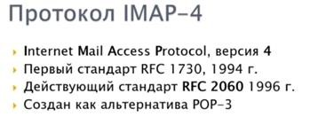 

Какие **особенности** протокола IMAP-4, и в чем он сильно отличается от протокола POP-3. 

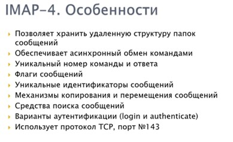 

- Во-первых, он **позволяет хранить удалённую структуру папок сообщений**. То есть мы можем на сервере создавать сколь угодно много папок и размещать сообщения в этих папках. 
- Во-вторых, он **обеспечивает асинхронный обмен командами** с поддержкой так называемого **уникального номера команды и номер ответа**. Это позволяет нескольким клиентам одновременно подключаться к серверу и не блокировать почтовый ящик. 
- В-третьих, он **поддерживает флаги сообщений,** причем как системные флаги предопределенные, так и пользовательские флаги и этим активно пользуются почтовые клиенты. 
- Так же, как в POP-3, все **сообщения имеют уникальные идентификаторы**. 
- Есть **механизмы работы с сообщениями на сервере**, без закачивания их клиентам (механизмы копирования и перемещения сообщений). 
- Есть несколько возможностей **поиска сообщений** прямо на сервере. 
- Есть **два варианта аутентификации**: login(опасный) и authenticate(безопасный). 

Технически реализуется поверх протокола **TCP**, номер порта - **143**. 

Поговорим подробнее об особенностях, начнём с **флагов сообщений**. 

Это очень удобная вещь. Есть два типа флагов: 

- **системные флаги**. Поддерживаются 5 системных флагов они начинаются с **\**. **
  - Seen** - просмотренные письма, 
  - **Answered** - отвеченные письма, 
  - **Deleted** - удаленные письма (помеченные на удаление), 
  - **Draft** – черновики, 
  - **Recent** - новые сообщения. 
- **пользовательские флаги**. Плюс к этому разрешается создавать пользовательские флаги. То есть пользователь может создать флаг сообщения и он как метаинформация будет храниться вместе с вашим сообщением, а клиенты имеют возможность делать выборку сообщений по этому флагу, фильтровать сообщения по флагам и т.д. 

## Команды IMAP-4 

В IMAP-4 также используется текстовый формат команд, но, при этом, протокол более новый и уже нет ограничений на то, что команды должны быть четырехбуквенными. Здесь могут команды любой длины быть. И, кроме всего прочего, для организации асинхронной работы, каждая команда может предваряться уникальным идентификатором сообщения. 

 Список команд: 

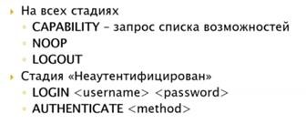 

**Независимо** от того, в какой **стадии** работы мы находимся, всегда есть несколько команд. 

- Команда **CAPABILITY** показывает те возможности, которые реализованы в данном IMAP-4 сервере (некоторые серверы не все возможности реализуют). 
- **NOOP** - тестовая команда “нет операции”. 
- **LOGOUT** – выйти. 

На стадии, когда мы еще **не аутентифицированы**, у нас есть команда **LOGIN** **<username> <password>**, которая позволяет подсоединиться к ящику небезопасным способом, команда **AUTHENTICATE <method>**, которая позволяет то же самое сделать, но безопасно, используя RFC 1731 в качестве каталога методов аутентификации. 

Если аутентификация прошла успешно, есть набор команд, который может происходить на **стадии “Аутентифицирован**”. (В терминах IMAP-4, почтовые папки называются ящиками). Итак, есть следующие команды: 

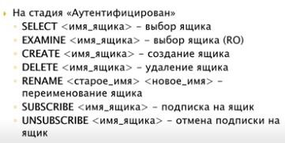 

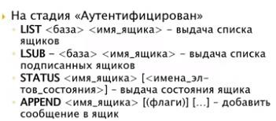 

- **SELECT <имя ящика>** - выбор конкретной папки в качестве текущей. 
- **EXAMINE <имя ящика>** - то же самое, но ящик открывается только для чтения (только на просмотр). 
- **CREATE <имя ящика>** - создать почтовую папку. 
- **DELETE <имя ящика>** - удалить почтовую папку. 
- **RENAME <старое_имя> <новое_имя> -** переименовать. 
- **SUBSCRIBE <имя ящика> -** подписка на папку. Фокус в том, что клиент может захотеть видеть у себя не все папки. У тех папок, на которые он подписался, будет добавляться специальный флаг, который будет показывать необходимо ли копировать сообщения данной папки при связи с сервером. 
- **UNSUBSCRIBE <имя ящика> -** то же самое, но флаг будет убран. 
- **APPEND <имя_ящика> -** одна из команд, которая позволяет перемещать сообщения на сервере. 

На стадии, когда мы уже сделали выборку, есть определенное количество команд уже внутри папки: 

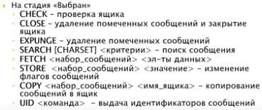 

**EXPUNGE –** удаление сообщений без закрытия ящика. 

**SEARCH и FETCH** – команды поиска с разными атрибутами, где можно осуществлять поиск на сервере средствами сервера приложений. 

В отличие от протокола POP-3 здесь может быть много разных ответов, порядка пятнадцати разных ответов: 

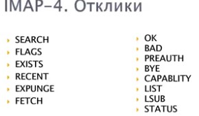 

Важно, что и команды, и ответы начинаются с идентификатора.

Когда мы выдаем какую-то команду, например, долгая команда счетчик, то она начинается с уникального идентификатора. 

Она может выполняться несколько минут, а мы хотим продолжать работать с сервером. В этом случае команда синхронно работает. И мы выполняем какие-то другие команды. 

По идентификации ответа мы можем понять, к какой команде он относится и это делает полностью параллельный процесс общения с ящиком, чего невозможно было бы сделать в протоколе POP-3. 

Возьмем за пример почтовый ящик, к которому привязано несколько устройств. Это дает такую возможность в любой момент обновить информацию о почте, т.к. у вас одновременно асинхронно подключаются несколько устройств, они делают разные команды и делают их асинхронно и никаких проблем с подключением большого числа клиентов нет.      

# 43. Протокол передачи файлов FTP. Активный режим.

**FTP** – один из важнейших, базовый протокол передачи файлов в компьютерных сетях.

Первый стандарт RFC 114, 1971 г.

Действующий стандарт RFC 959, 1985 г. 

Один из базовых протоколов TCP/IP 

**Использует транспорт TCP**, использует передачу текстовых команд для организации управления, то есть в одну сторону передаются текстовые команды с параметрами в другую передаются текстовые ответы с статусами.

Поддерживает 2 режима передачи, это базовый (активный) и пассивный.

Один из немногих 2-х канальных протоколов TCP/IP:

- Управляющий канал – по нему передаются управляющие сообщеня и получаются коды ответов и этот канал существует на протяжении всего обмена и обычно использует 21 порт (порт передачи команд)
- Канал данных – используется только тогда, когда требуется передать при помощи FTP большие данные (файлы либо каталоги). При этом это одноразовый временный канал, он организуется только на время передачи данных и потом закрывается. В зависимости от режима работы использует либо **20 порт в активном режиме** либо **непривилигорованный в пассивном**

**Активность** в режиме означает то, какая сторона является активной с точки зрения открытия канала данных.

В активном режиме активной стороной является сервер, он сам организует канал данных с клиентом, в пассивном режиме наоборот

**Активный режим**

- Режим «по умолчанию» 
- Сервер инициирует соединение данных 
- Клиент открывает слушающий порт . **На клиенте** **FTP организуется слушающий сокет, то есть серверный сокет**
- Номер TCP-порта сервера – 20. Из-за того, что в этом режиме сервер сам открывает соединение клиенту он должен знать IP адрес клиента и этот адрес должен быть доступен из вне и, как следствие, невозможно использовать с технологиями типа NAT, Proxy
- Обычно запрещён в межсетевых экранах

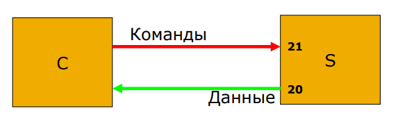

Клиент, когда хочет организовать канал обмена данными он организует канал команд и организует соединение с 21 портом сервера. В момент когда понадобиться передача данных сервер самостоятельно организует связь с клиентским сокетом по которому будут передаваться данные, при этом данные могут передаваться в обе стороны как на прием так и на передачу. Стрелка это только указатель того, кто был инициализатором установления соединения для передачи.

# 44. **Протокол передачи файлов FTP. Пассивный режим**.

[FTP - Вопрос 43](#43.-протокол-передачи-файлов-ftp.-активный режим.)

## Пассивный режим

- Клиент инициирует соединение данных 
- Сервер информирует о параметрах канала данных 
- Сервер открывает слушающий порт 
- Изначально поддерживается не всеми реализациями

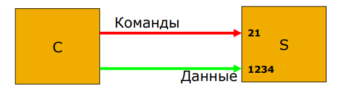

Канал связи открывает клиент. Номер порта выбирается непривилигированный, он каждый раз выбирается новый и информация об этом номере передается клиенту. Это может быть не очень удобно, что номер порта будет абстрактный, с точки зрения построения фаервола это тоже не очень просто, так как редко когда серверный порт заранее не определен и данном случае он как раз не определен

**Теперь на уровне описания самого протокола**

**Описание команд FTP**

- USER – имя. Команда аутентификации
- PASS – пароль. Команда аутентификации. Команды передаются в открытом виде и протокол уязъвим. 

Команды передаются в открытом виде и протокол уязвим. По поводу USER и PASS, так как FTP используется не только для доступа к частным архивам но и для доступа к публичным архивам, для публичных архивов есть соглашение, что пользователи подключающиеся к публичному архиву в качестве имени пользователя указывают предопределенное слово **анонимус** а в качестве пароля свою **электронную почту.** Но как таковое это не проверялось. И вроде получается, что в пароле просто достаточно указать строку с собачкой

- REIN – реинициализация 
- ABOR – прервать обмены 
- QUIT – завершение сесии

**Команды, оперирующие с файловой системой**

- DELE <имя> – удалить файла Если позволяют права. Анонимному пользователю обычно ничего не позволялось удалять
- RNFR <имя> - переименовать из 
- RNTO <имя> - переименовать в 
  - Перед RNTO выполняется RNFR
- CWD <путь> - сменить каталог 
- CDUP – перейти в родительский каталог 
- RMD <имя> - удалить каталог 
- MKD <имя>  - создать каталог 
- PWD – показать текущий каталог

## Команды управления режимом работы сервера

- PORT a1, a2, a3, a4, p1, p2 - перевод сервера в активный режи
  - Клиент выдает такую команду. Параметры это 6 байт или октетов, первые 4 байта это IP адрес а последние два это номер порта. Клиент говорит, что он ждет соединение по адресу a1.a2.a3.a4 и по номеру порта вычисляющему по формуле. Передав эти значения клиент инфмирт сервер куда над содиняться и сервер когда требуется создать канал данных соединяться с этим адресом и портом. Так команда переводит в активный режим
  - Address = ‘a1.a2.a3.a4’ 
  - Port = p1*256+p2 . Клиент выдает такую команду. 

- PASV <без параметров> – перевод сервера в пассивный режим. 
  - В качестве ответа сервер присылает те же 6 чисел, то есть он ждет от клиента соединение по адресу a1, a2, a3, a4 и номеру порта где p1 и p2 это старший и младший актет. Режимы разделяются на сессии а не сам сервер, то есть сервер формально  может работать с клиентами в разных режимах но по сути мы говорим, что ближайшая передача будет такая. <u>Чаще всего все пользуются одним режимом и этот PASV (Этот момент уточнил Стас)</u>
  - <u>227 a1, a2, a3, a4, p1, p2  (что тут за 227 Ицыксон не говорит, не знаю удалять или нет)</u>
- TYPE {A|E|I} – представление информации.  
  - Первая два режима это текстовый режим а последний бинарный режим. FTP реализует небольшую функцию представительского уровня, в TCP/IP нет явно представительского уровня и он реализуется протоколами (так предложение сформулировал Ицыксон). Одна из функций этого уровня это согласование форматов. Так сложилось, что в Windows и Unix  используется разное кодирование элементов текстового файла, например в win перевод строки это 2 символа а в unix 1 символом. Соответственно FTP предлагает согласование форматов в случае передачи текстового файла и в режиме TYPE A (стандартный режим передачи текстовых файлов) можно попросить клиента с севрвером  согласовали передачув файлов. Полученный с сервера файл в нем происходит перекодировка 2 символов перевода строки в одну сторону и в другую, то есть формально текстовый файл мы передаем как текстовый файл. Если выбрать бинарный режим, то в нем передача происходит без искажений. Актуалосчка 80-90.
  - A - ASCII
  - E - EDCDIC
  - I – Image 
- MODE {S|B|C} – режим передачи данных. Можно попросить сервер передавать в разном режиме. В Compressed режиме файл перед тем как передаваться архивируется в алгоритм похожий на zip.
  - S – Stream
  - B – Block
  - C – Compressed

## Команды, использующие канал данных

- RETR < имя > - получить файл 
- STOR < имя > - записать файл 
- LIST [<путь>] – получить список файлов с атрибутами. По стандарту FTP присылается в формате команды ls системы unix
- NLST [<путь>] – получить список имен файлов

Как только клиент выбирает одну из этих команд сразу происходит соединение по второму сокету по которому происходит реальная передача данных.

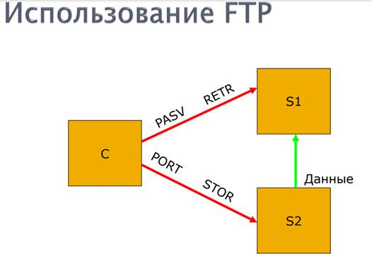

Из-за того, что клиент и сервер присылают друг другу не только порт но и IP адресс, это позволяет сделать следующее. У нас есть 2 сервера и мы хотим передавать между ними данные, сам по себе протокол без всяких хитростей заставил бы сначала скачать с S1 скачать на клиента а потом на S2, но можно обйтись без клиентского канала и передавать между серверами. Клиент соединяться с серверами, s1 сервер в пассивный, s1 передает клиенту данные где он ожидает соединение а s2 в активный режим а в качестве параметров передаются данные сервера и в итоге канал данных получается между серверами

## Недостатки

- Не поддерживает шифрования 
- Не поддерживает безопасной аутентификации 
- Не поддерживает современных средств адресации. Не работает с URL, надо переходить по каталогам 
- Сложность работы с защищенными сетями

## Достоинства 

- Эффективность. Использует 2 канала данных 
- Гибкость. Для определенной степени, позволяет обеспечить навигацию потоково каталогов

# 45. Протокол HTTP. Формат запроса.

- Протокол передачи файлов. Но данные могут передаваться по разному, как передача объектов или гипертекстовой информации
- HTTP/1.0 RFC 1945, 1996 г. 
- HTTP/1.1 RFC 2068, 1997 г.
- Действующий стандарт HTTP/1.1 RFC 2616, 1999г.

HTTP запрос формируется как запрос состоящий из заголовков и тела запроса следующего формата

## Формат HTTP-запроса

Сначала идет некоторое колисчетсво заголовков потом пустая строка и потом тело. Все что <> кроме первой строчки это целый список возможных заголовков. Особенность HTTP в том, что у него может быть очень много заголовков при помози которых мы можем управлять тем, что происходит в сети

`<Request-line>` - строка запроса. Используется только в запросе

`<General-header>` - общий заголовок Используется только в запросе

`<Request-header>` - заголовок запроса Может быть и в запросе и в ответе

`<Entity-header>` - заголовок сообщения Может быть и в запросе и в ответе

`<Body>` - тело

## Строка запрса

HTTP-запрос начинается со строки запроса. Имеет 3 параметра

**Формат:** < METHOD > < URL > < HTTP-VERSION >

- `< METHOD >` - что мы хотим сделать с ресурсом
- `< URL >` - это ресурс который мы запрашиваем. В большинстве случаев ресурс HTTP-шный поэтому это скорее всего адрес веб страницы или ресурса на ней
- `< HTTP-VERSION >` - поддерживаемая версия HTTP. 1.0, 0.9, 1.1, 2.0

**Методы:** 

- GET – запросить с помощью HTTP ресурс
- POST – передать в ресурс какие-то параметры в теле запроса. Например для передачи данных для поискового сервера
- HEAD – запросить только заголовок ресурса, например если ресурс не изменился и находиться в кэше
- PUT - поместить ресурс
- DELETE – удалить ресур
  - PUT и DELETE используются в системах публикации
- OPTIONS – передача опций
- и т.п. 

**URL:**

- `[method://][user[:pass]@]host[:port][/path][?name=val{&name=val}][#anchor] `

URL – стандартизированный по RFC формат доступа к ресурсу

**Версия:** 

- HTTP/1.0, HTTP/1.1 или HTTP/2 (new)

## Заголовки

### Общий заголовок (General-header)

Присутствует, когда есть тело сообщения

- Connection – должны ли сохранять соединение. В отличии от всех протоколов которые поддерживают состояние соединения штатный вариант работы HTTP это соединились, послали запрос, получили ответ и разорвали соединение, то есть это протокол без сохранения соединения чтобы не использовать ресурсы сервера. В Connection можно передать опцию которая соохранит соединение но это внештатный режим работы
- Data
- Pragma
- Transfer-encoding
- Upgrade
- no-cache
- И т.д.

### Заголовок запроса (Request-header)

- Accept: принимаемый контент 
- Accept-Charset: принимаемый набор символов
- Accept-Encoding: compress, zip 
- Accept-Language: da, ru 

Заголовки Accept указывают на те параметры контента которые приемлмы для клиента. Например чтобы передавали страницу на русском языке. Так работает что одну страничку выдают разным пользователям на разном языке

- Authorization: basic xxx=******. Один из способов передачи логина и пароля на сервер. После Authorization используется ключевое слово как здесь basic 
- From:
- Host:
- If-modified-since:… -выдать стриницу если она модифицированна только с какого-то времени
- Referrer: - для построение цепоцек связи. Показывает откуда мы пришли на текущую страницку 
- User-agent: - что за пользовательский агент у нас используется это тип браузера, но при этом всегда првый текст что они предают это что браузер mozila 
- И т.д.

### Заголовок сообщения (Entity-header)

- Allow: GET, POST, HEAD – какие команды поддерживает 
- Content-Encoding: x-zip 
- Content-Language:
- Content-Length: 1245 
- Content-Type: ...text/html; charset=win-1251 

Content описывает то, что находиться в теле

- Expires:
- Last-Modified:

# 46. Протокол HTTP. Формат ответа.

[Протокол HTTP - Вопрос 45](#45.-протокол-http.-формат-запроса.)

## Формат ответа.

- `<Status-line>` - Строка статуса 
  - Формат: `<HTTP-VERSION> <Code> <Phrase>`
    - `<HTTP-VERSION>` - Используемая версия Http 
    - `<Code>` - Код ошибки
      - 1xx - информационные
      - 2хх - ОК
      - 3хх - переадресация
      - 4хх - ошибка клиента
      - 5хх - ошибка сервера
    - `<Phrase>` - Кодовая фраза
- `<General-Header>` - Общий заголовок 
- `<Response-header>` - Заголовок ответа 
  - `Location` - переадресация (если, например, ресурс переехал, указывает новый актуальный адрес)
  - `Server` - спецификация сервера (инфо о сервере, аналог `USER-AGENT`)
  - `WWW-Authenticate: basic realm=’localzone’` - сопровождает ошибку о том, что требуется аутентификация (указывает режим аутентификации и область, в которую нужно войти)
- `<Entity-header>` - Заголовок сообщения 
- `<Body>` - тело 

# 47. Архитектура IPv6. Адресация.

**Длина адреса** - 128 разрядов

## Общий формат адреса

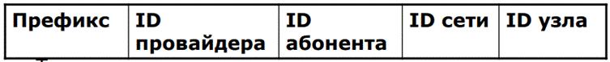

## **Типы адресов:**

- Unicast:
  - Global - Глобальный адрес
  - Link-local - Адрес линии (без деления на подсети)
  - Site-local - Адрес узла(с делением на подсети)
- Anycast
- Multicast

## Префикс:

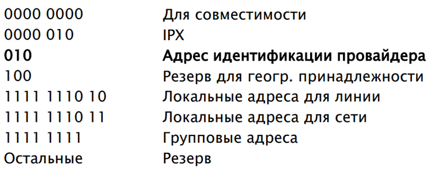

 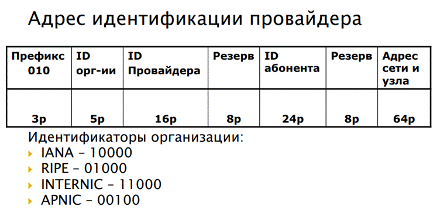

## Специальные адреса:

- Петля обратной связи: 0:0:0:0:0:0:0:1
- Не специфицированный адрес: 0:0:0:0:0:0:0:0
- Локальные адреса для линии 1111111010 000..000 iii.iii
  - Используются для адресации в локальных сегментах сетей (соединениях «точка-точка» и т.п.) **Должны НЕ маршрутизироваться!**
- Локальные адреса для сети 1111111011 000..000 sss..sss iii.iii
  - Используются для организации адресации во внутренних сетях При включении в сеть Интернет префикс может быть заменен на «Адрес идент. провайдера». **НЕ должны маршрутизироваться вне данной сети!** 

## Anycast адресация:

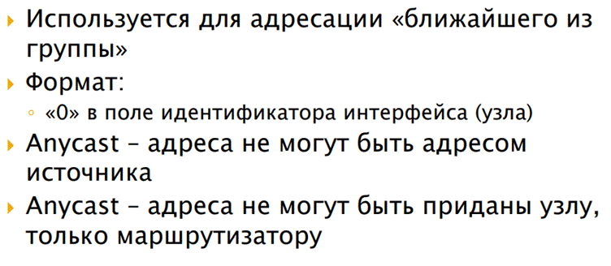

## Групповая адресация:

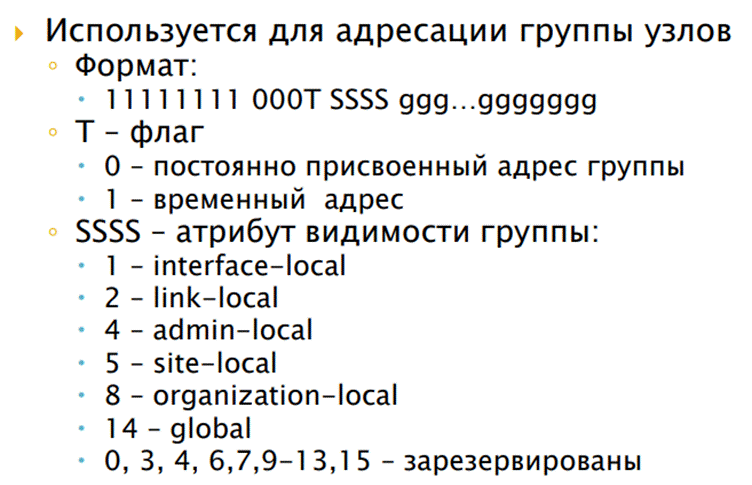

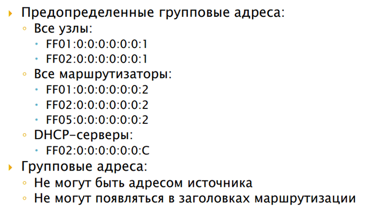

# 48. Архитектура IPv6. Сетевой уровень.

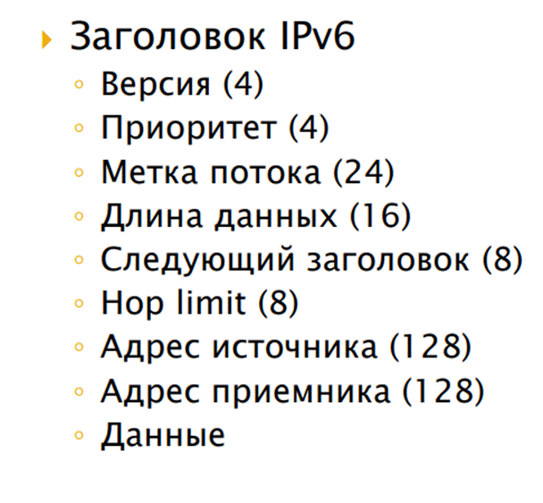

В стандартном заголовке нет опций , но у нас есть цепочки заголовков. Цепочки заголовков - это технология придуманная для того чтобы упростить основной заголовок и все ненужные данные разнести в разные заголовки.

## Виды заголовков:

- Hop-by-hop options header - заголовок опций которые передаются всем маршрутизаторам.
- Fragmentation header - если требуется фрагментация.
- Routing header - если требуется маршрутизация от источника.
- Destination options header 
- Authentication header (AH) - заголовок аутентификации
- Encapsulation security payload header (ESP) - заголовок шифрования

## Фрагментация:

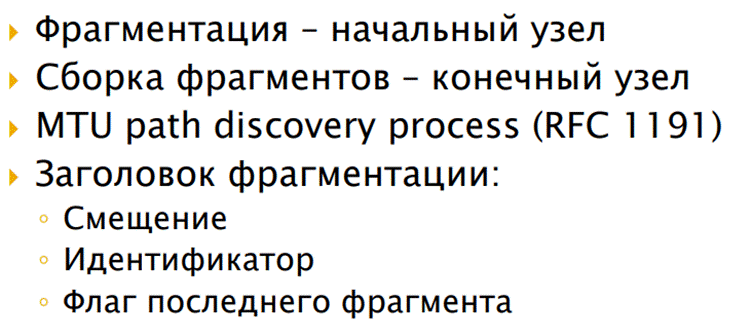

## Протокол ARP заменен на NDP.

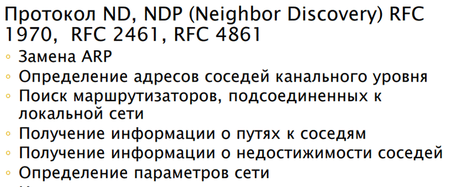

## Протокол ICMPv6:

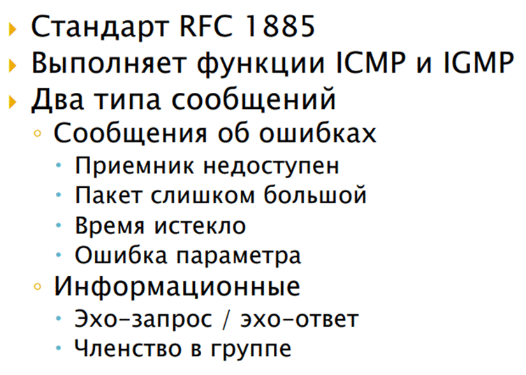

# 49. Архитектура IPv6. Транспортный уровень, DNS, безопасность.

## Транспортный уровень

*(!TODO)*

[Протокол UDP – 11 вопрос]()

[Протокол TCP – 12-13 вопросы]()

[Протокол SCTP – 14 вопрос]()

Транспортные механизмы в IPv6 не изменились – по-прежнему используются протоколы TCP, UDP, а также с самого начала IPv6 есть поддержка протокола SCTP. RFC 2960, RFC 3257.

## DNS

*(!TODO)*

[DNS – 26-32 вопросы]()

[DNS. Прямой поиск – 27 вопрос ]()

[DNS. Обратный поиск – 31 вопрос]()

- Для прямого преобразования добавлена одна ресурсная запись стандарта DNS, кроме записи `A` появилась запись `AAAA` (`A` - 32 разряда, а теперь 128 разрядов, т.е. 4*`A`, соответственно и длина адреса в 4 раза больше). Описано в RFC 1886.
- Обратное преобразование сделано также, как и в IPv4, через обратную зону, только теперь не через in-addr.arpa, а через ip6.arpa. Описано в RFC 3152.

## Безопасность

- Есть архитектура безопасности IPSEC, которая была разработана еще для IPv4 как внешнее дополнение. В IPv6 эта архитектура уже встроена.
- 2 протокола: Заголовок аутентификации AH и Заголовок шифрования ESP. Они по сути и реализуют эту архитектуру IPSEC, которая позволяет в двух режимах (транпортном и туннельном) обеспечивать полную защиту трафика, поэтому IPv6 изначально хорошо защищенная сеть.

# 50. Архитектура IPv6. Переход от IPv4 к IPv6.

Предпосылки развития связаны с недостатками протокола IPv4:

- Малое адресное пространство (32-битная адресация -> 232 = 4294967296 адресов)
- Неудобный формат адреса
- Сложная маршрутизация
- Низкая защищенность
  - Отсутствие шифрования
  - Отсутствие аутентификации
- Низкая эффективность передачи

## Сосуществование стеков

В 1995 году, когда вышел RFC на IPv6, было сказано, что в 2000 году IPv4 не останется, все перейдут на IPv6. Потом сказали, что к 2000 году не удалось, перейдем к 2005, потом к 2010, к 2015, к 2020. Сейчас есть оптимистичный прогноз на 2025 год, но в отличие от всех предыдущих случаев уже сейчас, примерно с 2015 года вся инфраструктура сети Интернет уже готова к переходу на IPv6, все маршрутизаторы поддерживают IPv6, все программные маршрутизаторы поддерживают, все ОС имеют стек протоколов IPv6. И сейчас вопрос перехода не технический, а организационный.

Как происходит сейчас переход на IPv6 (а уже существенная часть сети перешла на IPv6)? Есть несколько способов:

- **Двойные стеки протоколов:** компьютере поднимаются оба стека протоколов и часть приложений привязывается к стеку протоколов IPv4, а часть к IPv6)
- **Туннелирование:** вид маршрутизации, когда трафик одного типа запаковывается в трафик другого типа (используется в VPN). Островки сети IPv6 туннелируются сквозь сети IPv4 через программные туннели и для узлов IPv6 это прозрачно, потому что туннели — это прозрачная технология для прикладных программ.

- **Трансляция адресов:** когда пакет из сети IPv6 пришел на границу сети и дальше идут сети IPv4, то происходит трансляция одного адреса в другой.

 

 
