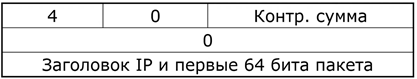
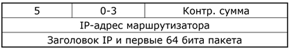
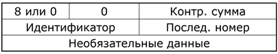
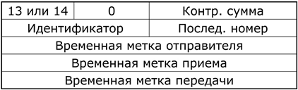
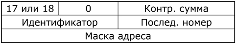
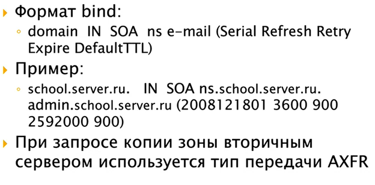
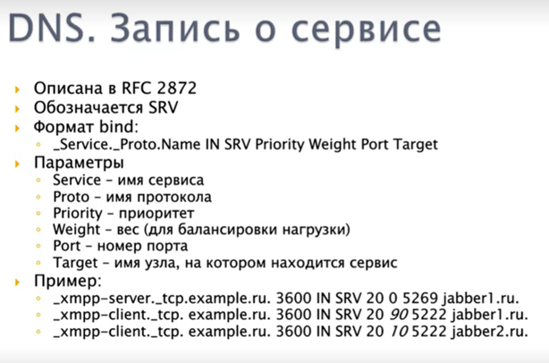

# 8. Управляющий протокол ICMP. Сигнализирующие сообщения.

## Общие сведения

- Протокол сетевого уровня;
- Решает задачи 
  - управления,
  - нотификации об ошибках, 
  - тестирования и мониторинга;
- Инкапсулируется в IP *(да, протокол сетевого уровня в протоколе сетевого уровня)*;
- Описан в RFC792.

Задачи управления и нотификации – базовые функции сетевого уровня. При этом авторы архитектуры не зашили это в протокол IP, а выделили в отдельный протокол. Один из важнейших для стека TCP/IP.

ICMP-трафик обычно не пускают на широковещательные адреса.

## Организация протокола ICMP

Общая часть заголовка *(8, 8, 16 бит)*:

- Тип – тип пакета;
- Код – расшифровка типа (подтип);
- Контрольная сумма вычисляется для всего пакета.

Остальная часть пакета зависит от типа ICMP-пакета.

## Нотификационные (сигнализирующие) сообщения

Информируют отправителя о каком-либо событии в сети.

***Нотификационные сообщения фильтровать нельзя!***

### Основные типы:

- 3 – получатель недостижим *(нельзя фильтровать в своей сети)*: 
  - Тип (3);
  - Код *(причина «недостижимости»)*:
    - 0 – сеть недостижима;
    - 1 – узел недостижим;
    - 2 – протокол недостижим *(например, хотим доставить по* *TCP, но приемная сторона его не поддерживает)*;
    - 3 – порт недостижим *(когда никто {сервис, приложение} не прослушивает порт)*;
    - 4 – требуется фрагментация *(в* *IP-пакете установлен флаг, запрещающий фрагментацию, но сам пакет слишком большой для передачи целиком по каналу)*;
    - 5 – ошибка маршрутизации от источника *(когда не можем строго пройти через указанные адреса {строгая маршрутизация от источника в* *IP})*;
    - 6 – сеть назначения неизвестна *(обычно – попытки маршрутизации в сеть класса Е, то есть в адреса, которые не маршрутизируются в сетях* *TCP/**IP)*;
    - 7 – узел назначения неизвестен *(c**м. 6)*;
    - 8 – отправитель изолирован *(обычно – нет действующих интерфейсов для отправки пакета)*;
    - 9 – взаимодействие с сетью назначения административно запрещено *(фаервол – стоит правило* *REJECT {а вообще есть* *accept,* *deny,* *reject, но обычно во избежание перегрузки сети ответными пакетами ставят* *DENY и молча отбрасывают пакеты})*;
    - 10 – взаимодействие с узлом назначения административно запрещено *(см 9)*.
    - 11 – сеть недостижима из-за класса обслуживания *(используются разряды* *TOS, на всех маршрутизаторах внутри сети настроено управление качеством обслуживания, а мы запросили сервис выше нашего уровня)*;
    - 12 – узел недостижим из-за класса обслуживания *(см. 11)*.
  - Контрольная сумма;
  - Нулевое слово;
  - Заголовок и первые два слова пакета *(который не смогли доставить)*;
- 11 – превышено время *(нельзя фильтровать в своей сети)*: 
  - Тип (11);
  - Код:
    - 0 – превышено TTL;
    - 1 – превышено время ожидания фрагмента при сборке;
  - Последнее поле содержит первую часть пакета, фрагмент которого не дошел;
- 12 – ошибка параметра *(нельзя фильтровать в своей сети)*: 
  - Тип (12);
  - Указатель (байтовый). *(В случае, если какой-либо из промежуточных маршрутизаторов или конечный узел, проанализировав заголовок* *IP-пакета, определил, что произошла ошибка {невалидное значение поля, неверная контрольная сумма…}, он сообщает о ней, указывая номер ошибочного байта)*;
  - Последнее поле содержит первую часть пакета, в котором обнаружена ошибка;

# 9. Управляющий протокол ICMP. Управляющие и тестовые сообщения

*(!TODO)*

**Общие сведения ICMP** – 8 вопрос 

## Управляющие сообщения

Управляющие сообщения – попытка «повлиять» на саму сеть.

### Основные типы:

- 4 – подавление источника *(не синхронизирована скорость передачи данных между передатчиком и приемником. Если передатчик слишком быстро передает пакеты, приемная сторона передает следующий пакет. Передающая сторона по умолчанию снижает скорость передачи в 2 раза. Фильтровать нежелательно)*:
   
  - Тип (4);
  - Последнее поле содержит первую часть пакета, поток которого необходимо замедлить;
- 5 – изменение маршрута *(если пакет с точки зрения маршрутизатора отправляется неоптимальным путем. Отправляет ответ отправителю в качестве совета по перемаршрутизауции)*:
   
   
   *Легко подделывается. С начала 2000-х фильтруется во всех ОС. По возможности такие пакеты убиваются на всех маршрутизаторах!
   Проблемы:*
   *Функция маршрутизации реализуется протоколами маршрутизации, а не* *ICMP-протоколом (управляющим). Невозможно проконтролировать, кто создал пакет и валидный ли он.*
  - Тип (5);
  - Код *(тип переназначения маршрута)*:
    - 0 – для всей сети,
    - 1 – для узла,
    - 2 – для типа сервиса и сети,
    - 3 – для типа сервиса и узла;
  - IP-адрес маршрутизатора, *куда* необходимо присылать пакеты;
  - Заголовок IP-пакета, который (с точки зрения маршрутизатора-отправителя) идет неоптимальным путем).

## Тестовые и контрольные сообщения

Позволяют проводить диагностику сети.

Обычно идут парами «запрос-ответ».

### Типы:

- Запрос эха (8) и ответ на запрос эха (0) *(**ping и* *pong. Проверка работоспособности удаленного узла. Используется в утилитах типа* *ping и ей подобных, позволяющих проверить достижимость узла в сети)*:
   
   Идея: станция посылает удаленной станции пакет с типом 8, промежуточные маршрутизаторы доводят его до последней станции. Та, получив его, уничтожает, в ответ формирует такой же пакет с типом 0, а в поле данных копирует те необязательные данные, которые были в поле эхо-запроса, после чего посылает обратно.
   *Обычно в своей сети разрешаем 8 на выход и 0 на вход. Остальное отрубаем. Иногда – ставим прокси (**ICMP-сервер), чтобы он формировал фейковые сообщения за все компьютеры в сети.*

  - Тип (8 или 0);
  - Идентификатор *(для различения пар потоков* *ping-ов и* *pong-ов. По нему определяется процесс, которому отдают ответный трафик)*;
  - Последовательный номер *(номер пакета в серии. Для посылки не одного, а нескольких пакетов. Для сопоставления ответа запросу)*;
  - Необязательные данные *(тестирование на прохождение пакетов данных определенного размера по каналу связи. Могут расширить* *ICMP-пакет до 64 Кб. Большие пакеты могут фильтроваться по размеру из-за имевшей место атаки «**ping* *of* *death»)*;

- Запрос временной метки (13) и ответ на запрос временной метки (14):
   
   
   *(позволяют определить временные параметры функционирования сети)*

  - Идентификатор – номер потока сообщений;
  - Последовательный номер – номер пакета в потоке;
  - (T1) **Временная метка отправителя** заполняется источником *(время, когда пакет улетел из отправителя)*;
  - (T2) **Временная метка приема** фиксируется при получении запроса приемником *(время, когда пакет пришел на приемную станцию)*;
  - (T3) **Временная метка передачи** заполняется приемником *(когда был послан ответ)*;
  - (T4) Еще мы знаем время, когда мы получим ответ обратно от приемника;
  - Проблемы:
    - Синхронизация часов;
    - Фильтрация.

- Запрос маски адреса (17) и ответ на запрос маски адреса (18):
   
   *(Чаще всего – чтобы узнать топологию удаленной сети. Считается опасным, не рекомендуется к использованию вне текущей сети)*.

  - Идентификатор – номер потока сообщений;

  - Последовательный номер – номер пакета в потоке;

  - Маска – записанная маска адреса приемника.

# 10. Адресация приложений. Понятие портов.

## Понятие портов

- Порт – уникальный номер приложения на узле, использующего конкретный транспортный протокол
- В TCP/IP порт – 16 разрядов (0...65535)
- Приложение идентифицируется сокетом:
  - IP-адресом узла
  - Типом транспортного протокола
  - Номером порта
- Примеры:
  - TCP-сокет: 195.19.212.13:80
  - UDP-сокет: 195.19.212.10:53
- Есть некоторые правила по умолчанию, которые все стараются соблюдать: 
  - Сервер обычно использует фиксированные номера портов из диапазона от 0 до 1023.
  - Клиент обычно использует непривилегированные номера портов из диапазона 1024+. В некоторых ОС для того, чтобы выдать приложению порт меньше 1024, требуется, чтобы приложение имело достаточно привилегий и прав. 
- Философия, которую пыталась сделать IANA, а теперь ICANN: 
  - 1024 адреса – это зарезервированные адреса, которые мы выдаём всем известным сервисам, а то, что выше 1024 – это свободно распространяемые номера портов.
  - Для сервера важно иметь предопределённый номер, потому что мы должны из разных узлов должны к нему обращаться и знать его номер, нам важно, чтобы он был фиксированный и публичный. А для клиента неважно, чтобы его номер был фиксированный, потому что к клиенту никто напрямую не обращается за редким исключением. Поэтому адрес клиента не должен быть публичным, его можно выдавать временно на 1 сеанс, что и сделано в большинстве протоколов.

# 16. Статическая маршрутизация. Таблицы маршрутизации.

**Статическая маршрутизация** – вид маршрутизации, при котором маршруты указываются в явном виде при конфигурации маршрутизатора администратором. Вся маршрутизация при этом происходит без участия каких-либо протоколов маршрутизации. Статический маршрут хранится в таблицах до выключения. 

При задании статического маршрута указывается:

- Адрес сети (на которую маршрутизируется трафик), маска сети
- Адрес шлюза (узла), который отвечает за дальнейшую маршрутизацию (или подключен к маршрутизируемой сети напрямую)
- (опционально) метрика ("цена") маршрута.

## Достоинства:

- Лёгкость отладки и конфигурирования в малых сетях
- Отсутствие дополнительных накладных расходов (из-за отсутствия протоколов маршрутизации)
- Мгновенная готовность (не требуется интервал для конфигурирования/подстройки)
- Низкая нагрузка на процессор маршрутизатора
- Предсказуемость в каждый момент времени

## Недостатки:

- Очень плохое масштабирование
- Низкая устойчивость к повреждениям линий связи
- Отсутствие динамического балансирования нагрузки
- Необходимость в ведении отдельной документации к маршрутам

В реальных условиях статическая маршрутизация используется в условиях наличия шлюза по умолчанию (узла, обладающего связностью с остальными узлами) и 1-2 сетями.

## Таблицы маршрутизации

Атрибуты маршрутных записей:

- Сеть/узел назначения
- Сетевой интерфейс
- Маршрутизатор
- Метрика маршрута
- Флаги

**Псевдомаршруты** – дополнительные записи в таблице маршрутизации, которые используются для унификации процедуры поиска маршрута. Типы:

- Псевдомаршрут на IP-адреса собственных интерфейсов
- Псевдомаршрут на подключенные IP-сети

**Маршрут «по умолчанию»** – специальный маршрут, которые используется в случае отсутствия явных маршрутов на целевую сеть, обозначение: 0.0.0.0/0.0.0.0

Утилита route предназначена для просмотра и управления таблицей маршрутизации.

В некоторых системах поддерживается несколько таблиц маршрутизации, в таких таблицах используется коммутация **по адресу источника** – в зависимости от адреса источника выбирается подчиненная таблица маршрутизации.

# 29. База данных DNS. Главная ресурсная запись. Маршрутизация электронной почты.

**База данных DNS** состоит из ресурсных записей – записи помогают выполнять запросы. Ресурсные записи хранят определенный тип информации, каждая запись содержит определенное количество полей.

Главная ресурсная запись **SOA** (start of authority). Предназначена для описания параметров домена. Имеет много параметров, так как является неким *паспортом* домена:

- **Имя домена** – имя домена, для которого сформирована главная запись
- **Имя первичного DNS-сервера** – сервер, который отвечает за адрес домена
- **Почтовый адрес администратора** – связь при проблемах
- **Серийный номер зоны (Serial)** – уникальный ID текущей зоны, увеличивается при изменении зоны
- **Период обновления(Refresh)** – время в секундах, как часто вторичный сервер должен обращаться к первичному
- **Время валидности данных(Expire)** – если первичный сервер не отвечает, Expire отвечает на запросы о зоне информации
- **Период повторных попыток (Retry)** - указывает задержку перед следующим обращением после неудачной попытки
- **Значение по умолчанию (DefaultTTL)** - Время жизни для всех записей в зоне

Главная ресурсная запись одна на зону.

AXFR – копируется вся зона.

## Запись о сервере эл.почты

- DNS используется для маршрутизации почты
- Почтовый домен не всегда связан с конкретным IP адресом.
- MX связывает IP- адреса и почтовые домены
- Приоритет задает желаемое качество доставки.

# 30 База данных DNS. Записи о псевдонимах, сервисах.

**Запись о псевдониме** – позволяет выдать новое имя уже известному адресу.

В реальном мире мало веб-серверов с именем www, практически всегда используется псевдоним. В конце 90-х появились веб-хостинги, в этом случае псевдоним используется как переключатель, что позволяет на одном физическом IP разместить неограниченное количество виртуальных адресов. Web-server узнает, к которому узлу обращаться благодаря особенностям http (URL хранится в заголовке http).

НЕ ИСОЛЬЗУЮТСЯ ДЛЯ МАРШРУТИЗАЦИИ ПОЧТЫ

## Запись о сервисе

Запись анонсирует наличие сервиса и его местонахождение. Запись о сервисе – относительно новая запись, расширяет идею MX, делает универсальным обращение к какой-либо службе. Вес используется чтобы распределять нагрузку между сервисами.

# 49. Архитектура IPv6. Транспортный уровень, DNS, безопасность.

## Транспортный уровень

*(!TODO)*

**Протокол TCP** – 12-13 вопросы 

**Протокол UDP** – 11 вопрос 

**Протокол SCTP** – 14 вопрос

Транспортные механизмы в IPv6 не изменились – по-прежнему используются протоколы TCP, UDP, а также с самого начала IPv6 есть поддержка протокола SCTP. RFC 2960, RFC 3257.

## DNS

*(!TODO)*

**DNS** – 26-32 вопросы 

**DNS. Прямой поиск** – 27 вопрос 

**DNS. Обратный поиск** – 31 вопрос

- Для прямого преобразования добавлена одна ресурсная запись стандарта DNS, кроме записи `A` появилась запись `AAAA` (`A` - 32 разряда, а теперь 128 разрядов, т.е. 4*`A`, соответственно и длина адреса в 4 раза больше). Описано в RFC 1886.
- Обратное преобразование сделано также, как и в IPv4, через обратную зону, только теперь не через in-addr.arpa, а через ip6.arpa. Описано в RFC 3152.

## Безопасность

- Есть архитектура безопасности IPSEC, которая была разработана еще для IPv4 как внешнее дополнение. В IPv6 эта архитектура уже встроена.
- 2 протокола: Заголовок аутентификации AH и Заголовок шифрования ESP. Они по сути и реализуют эту архитектуру IPSEC, которая позволяет в двух режимах (транпортном и туннельном) обеспечивать полную защиту трафика, поэтому IPv6 изначально хорошо защищенная сеть.

# 50. Архитектура IPv6. Переход от IPv4 к IPv6.

Предпосылки развития связаны с недостатками протокола IPv4:

- Малое адресное пространство (32-битная адресация -> 232 = 4294967296 адресов)
- Неудобный формат адреса
- Сложная маршрутизация
- Низкая защищенность
  - Отсутствие шифрования
  - Отсутствие аутентификации
- Низкая эффективность передачи

## Сосуществование стеков

В 1995 году, когда вышел RFC на IPv6, было сказано, что в 2000 году IPv4 не останется, все перейдут на IPv6. Потом сказали, что к 2000 году не удалось, перейдем к 2005, потом к 2010, к 2015, к 2020. Сейчас есть оптимистичный прогноз на 2025 год, но в отличие от всех предыдущих случаев уже сейчас, примерно с 2015 года вся инфраструктура сети Интернет уже готова к переходу на IPv6, все маршрутизаторы поддерживают IPv6, все программные маршрутизаторы поддерживают, все ОС имеют стек протоколов IPv6. И сейчас вопрос перехода не технический, а организационный.

Как происходит сейчас переход на IPv6 (а уже существенная часть сети перешла на IPv6)? Есть несколько способов:

- **Двойные стеки протоколов:** компьютере поднимаются оба стека протоколов и часть приложений привязывается к стеку протоколов IPv4, а часть к IPv6)
- **Туннелирование:** вид маршрутизации, когда трафик одного типа запаковывается в трафик другого типа (используется в VPN). Островки сети IPv6 туннелируются сквозь сети IPv4 через программные туннели и для узлов IPv6 это прозрачно, потому что туннели — это прозрачная технология для прикладных программ.

- **Трансляция адресов:** когда пакет из сети IPv6 пришел на границу сети и дальше идут сети IPv4, то происходит трансляция одного адреса в другой.

 

 